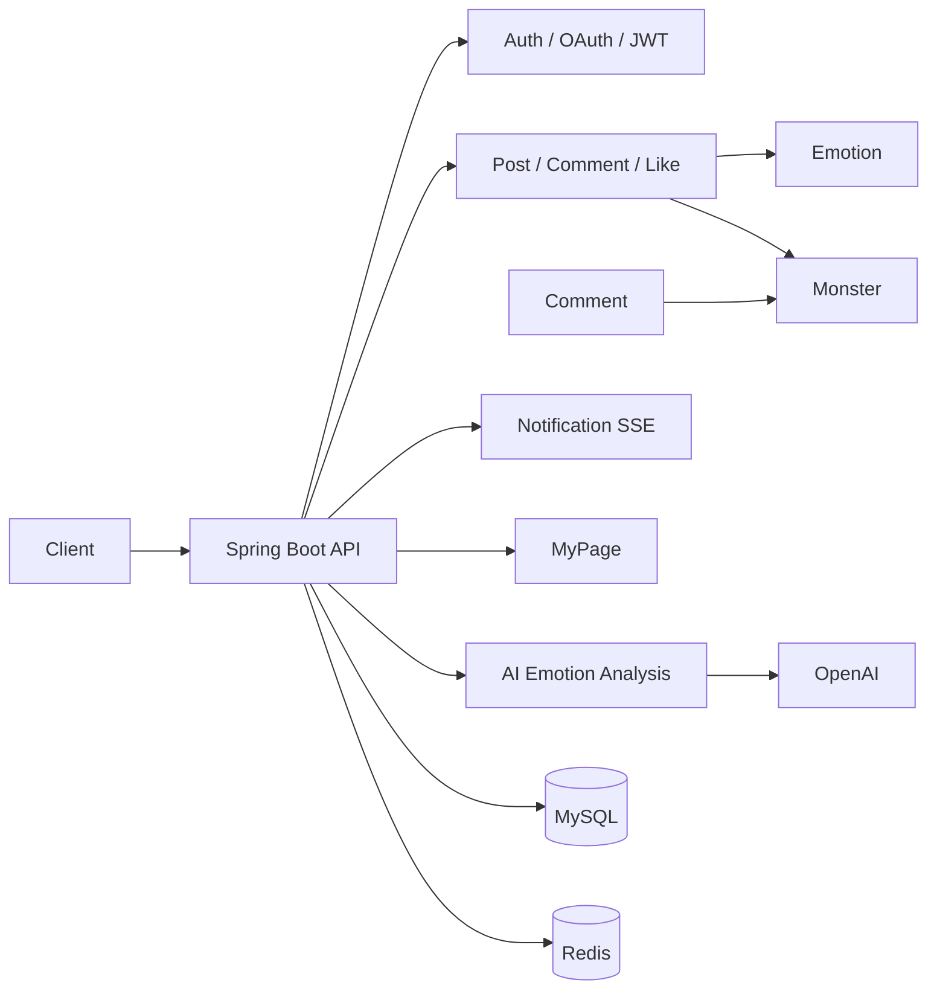
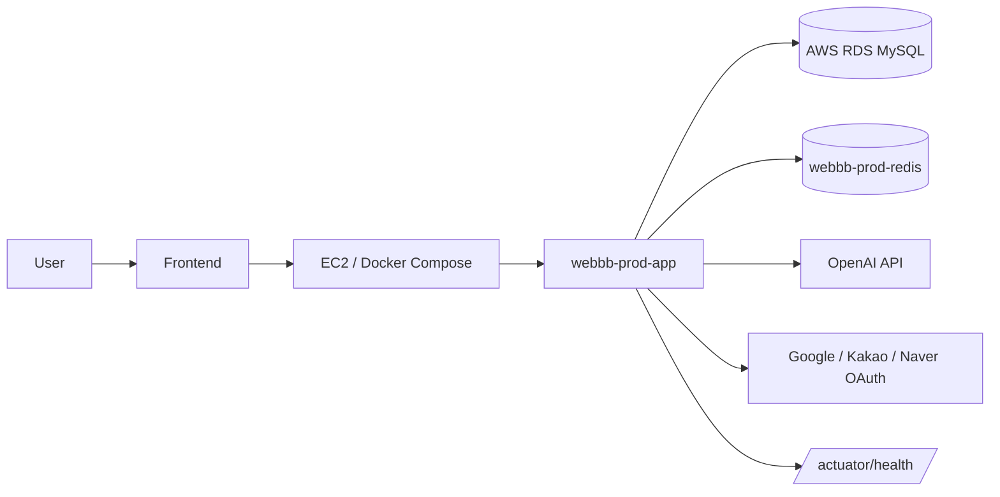
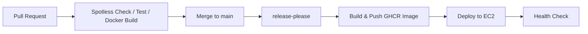

# WEBBB BE (오구오구)

## 🤩 감정을 나누고 함께 이겨내는 서비스, 오구오구를 소개합니다!

오구오구는 혼자 삼키기 어려운 고민과 감정을 익명으로 남기고, 
AI 감정 분석과 커뮤니티 반응을 통해 서로의 마음을 가볍게 만들어가는 서비스예요.

### 고민을 남기면

오늘의 고민을 게시글로 남기면 AI가 글 속 감정을 분석해 대표 감정과 몬스터를 생성해요. 
불안, 무기력, 외로움처럼 말로 정리하기 어려운 마음도 한눈에 확인할 수 있습니다.

### 함께 반응하며

댓글과 공감으로 서로를 응원할 수 있어요. 
사용자들의 반응이 쌓이면 감정 몬스터의 HP가 줄어들고, 함께 고민을 이겨내는 경험을 만들 수 있습니다.

### 나의 감정을 돌아보며

마이페이지에서 내가 작성한 글, 공감한 글, 댓글, 감정 통계를 확인할 수 있어요. 
실시간 알림으로 댓글과 몬스터 처치 소식도 놓치지 않고 받아볼 수 있습니다.

## ⚙️ 기술 스택

### Backend

| 구분 | 사용 기술 |
| --- | --- |
| Language | Java 21 |
| Framework | Spring Boot 3.4.5 |
| Web | Spring MVC, Spring Validation |
| Persistence | Spring Data JPA, QueryDSL, Flyway |
| Database | MySQL, H2(Test) |
| Cache / Event | Redis, Server-Sent Events(SSE) |
| Security / Auth | Spring Security, OAuth2 Client, JWT |
| AI | Spring AI, OpenAI, Resilience4j Retry / Circuit Breaker |
| API Docs | Springdoc OpenAPI, Swagger UI |
| Monitoring | Spring Boot Actuator, Micrometer, Prometheus |
| Build / Format | Gradle, Spotless, Google Java Format(AOSP) |
| Test | JUnit 5, Spring Boot Test, Spring Security Test |

### Infrastructure

| 구분 | 사용 기술 |
| --- | --- |
| Runtime | Docker, Docker Compose |
| Image Registry | GitHub Container Registry(GHCR) |
| Deployment | GitHub Actions, EC2 |
| Database | AWS RDS MySQL |
| Cache | Redis 7.0 |
| Release | release-please, Conventional Commits |
| Health Check | `/actuator/health` |

## 🧩 시스템 구조

오구오구 백엔드는 도메인별 패키지를 `interfaces`, `application`, `domain`, `infrastructure` 레이어로 나눕니다. 
컨트롤러는 서비스 유스케이스를 호출하고, 서비스는 도메인 모델과 Repository 인터페이스를 통해 게시글, 댓글, 감정, 몬스터, 알림 데이터를 처리합니다.

## 🏗️ 인프라 구조

운영 환경은 GHCR에 업로드된 Docker 이미지를 EC2에서 Docker Compose로 실행합니다. 
애플리케이션 컨테이너는 80번 포트로 외부 요청을 받고, Redis는 Docker 내부 네트워크에서만 통신합니다. 
DB 접속 정보, OAuth Client Secret, JWT Secret, OpenAI API Key 같은 민감 정보는 GitHub Actions Secret과 환경변수로 주입합니다.

## 🔄 CI/CD

- PR 단계에서 `spotlessCheck`, `test`, `docker build`를 실행해 머지 전 품질을 확인합니다.
- `main` 브랜치 변경은 release-please가 릴리즈 PR과 태그를 관리합니다.
- 릴리즈가 생성되면 GitHub Actions가 Docker 이미지를 GHCR에 push하고 EC2에 배포합니다.
- 수동 배포 워크플로우로 `latest` 또는 특정 릴리즈 태그를 재배포할 수 있습니다.

## 🌐 Backend 구성원
|                        [정다연](https://github.com/al1kite)                         |  [장현호](https://github.com/hyunolike)  |
|:------------------------------------------------------------------------------------:|  :--------:  |
|  |  |
