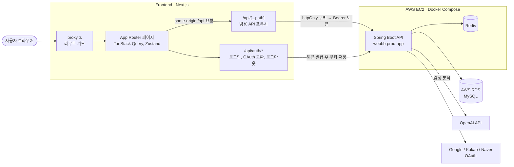
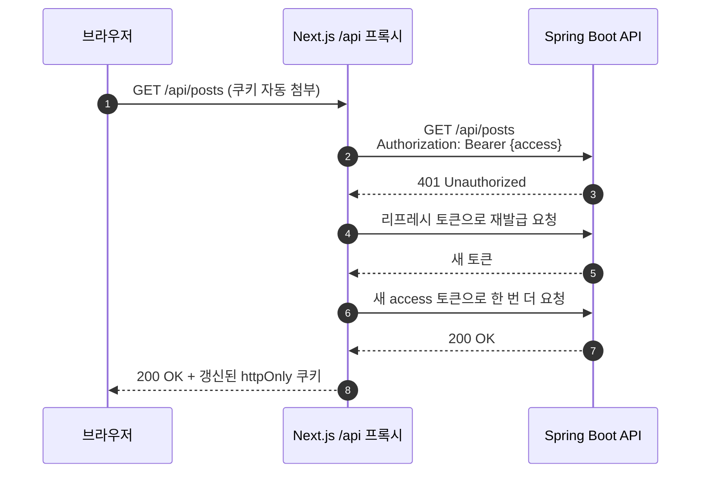
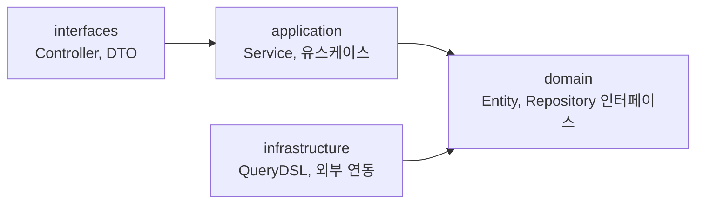
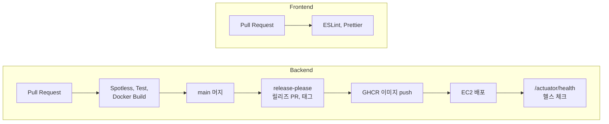

<div align="center">

# 🐾 오구오구 (5959)

### 감정을 나누고 함께 이겨내는 서비스

혼자 삼키기 어려운 고민을 익명으로 남기면<br>
AI가 감정을 분석해 몬스터로 만들고, 함께 반응하며 그 몬스터를 물리쳐요.

[](https://github.com/DDD-Community/DDD-13-WEBBB_BE)
[](https://github.com/DDD-Community/DDD-13-WEBBB-FE)

</div>

<br>

## 🐾 소개

오구오구는 DDD 13기 WEBBB 팀이 만든 감정 공유 커뮤니티입니다.
저는 이 팀의 백엔드 개발자로 참여해 [DDD-13-WEBBB_BE](https://github.com/DDD-Community/DDD-13-WEBBB_BE)를 함께 개발했습니다.
이 저장소는 원본 백엔드와 프론트엔드 저장소를 한곳에 모아 참고하면서 서비스를 다시 만들어 가는 공간입니다.

> 👤 **[장현호](https://github.com/hyunolike)** · DDD 13기 WEBBB 팀 백엔드

### 고민을 남기면

오늘의 고민을 글로 남기면 AI가 글 속 감정을 분석해 대표 감정과 몬스터를 만들어요.
불안이나 무기력, 외로움처럼 말로 정리하기 어려운 마음도 한눈에 볼 수 있습니다.

### 함께 반응하며

댓글과 공감으로 서로를 응원할 수 있어요.
반응이 쌓일수록 감정 몬스터의 HP가 줄어들고, 결국 함께 고민을 이겨내게 됩니다.

### 나의 감정을 돌아보며

마이페이지에서 내가 쓴 글과 공감한 글, 댓글, 감정 통계를 확인할 수 있어요.
댓글이 달리거나 몬스터를 처치하면 실시간 알림으로 알려 줍니다.

<br>

## 📁 저장소 구성

```
.
├── apps/
│   ├── api/        Kotlin · Spring Boot 4 · Spring Modulith
│   └── web/        Next.js 16 · Feature-Sliced Design
├── infra/          운영 compose, 배포와 백업 스크립트
├── specs/          GitHub Spec Kit 기능 스펙
├── docs/           아키텍처 설계와 ADR
├── webbb-be/       원본 백엔드 (DDD-13-WEBBB_BE, 참고용 subtree)
└── webbb-fe/       원본 프론트엔드 (DDD-13-WEBBB-FE, 참고용 subtree)
```

새로 만드는 코드는 `apps/`에 있습니다. 설계는 [`docs/architecture/overview.md`](docs/architecture/overview.md)에서, 개발 원칙은 [`.specify/memory/constitution.md`](.specify/memory/constitution.md)에서 볼 수 있습니다.

### 로컬 실행

```bash
cd apps/api && ./gradlew bootRun        # PostgreSQL은 compose로 자동 기동
pnpm install && pnpm --filter web dev   # http://localhost:3000
```

원본 저장소에 올라온 변경을 다시 받아오려면 아래 명령을 실행합니다.

```bash
git remote add webbb-be https://github.com/DDD-Community/DDD-13-WEBBB_BE.git   # 처음 한 번만
git remote add webbb-fe https://github.com/DDD-Community/DDD-13-WEBBB-FE.git   # 처음 한 번만

git subtree pull --prefix=webbb-be webbb-be main --squash
git subtree pull --prefix=webbb-fe webbb-fe main --squash
```

<br>

## 🛠 기술 스택

### Frontend

| 구분 | 사용 기술 |
| --- | --- |
| Framework | Next.js 16 (App Router), React 19 |
| Language | TypeScript |
| Styling | Tailwind CSS v4, class-variance-authority |
| Server State | TanStack Query v5 |
| Client State | Zustand v5 |
| Form | react-hook-form, Zod |
| Lint / Format | ESLint, Prettier, Husky, lint-staged |
| Package Manager | pnpm |

### Backend

| 구분 | 사용 기술 |
| --- | --- |
| Language | Java 21 |
| Framework | Spring Boot 3.4.5 |
| Persistence | Spring Data JPA, QueryDSL, Flyway |
| Database | MySQL, H2(Test) |
| Cache / Event | Redis, Server-Sent Events(SSE) |
| Auth | Spring Security, OAuth2 Client(Google, Kakao, Naver), JWT |
| AI | Spring AI, OpenAI, Resilience4j(Retry, Circuit Breaker) |
| API Docs | Springdoc OpenAPI, Swagger UI |
| Monitoring | Spring Boot Actuator, Micrometer, Prometheus |
| Build / Format | Gradle, Spotless(Google Java Format AOSP) |

### Infrastructure

| 구분 | 사용 기술 |
| --- | --- |
| Runtime | Docker, Docker Compose |
| Server | AWS EC2 |
| Database | AWS RDS MySQL |
| Image Registry | GitHub Container Registry(GHCR) |
| CI/CD | GitHub Actions, release-please |

<br>

## 🏛 시스템 구조



- 브라우저는 백엔드를 직접 호출하지 않습니다. 모든 요청은 같은 출처의 `/api/*`로 보내고, Next.js 서버 라우트가 백엔드로 전달합니다.
- 액세스 토큰과 리프레시 토큰은 httpOnly 쿠키에만 저장해서 브라우저 스크립트가 읽을 수 없게 했습니다. 프록시가 쿠키를 `Authorization: Bearer` 헤더로 바꿔 백엔드에 넘깁니다.
- 보호 경로(`/write`, `/onboarding`, `/my`, `/settings`)는 `proxy.ts`가 렌더링 전에 세션 쿠키를 확인하고, 없으면 `/login`으로 보냅니다.
- 백엔드 컨테이너는 80번 포트로 요청을 받고, Redis는 Docker 내부 네트워크에서만 통신합니다.

### 인증 요청 흐름



액세스 토큰이 만료되면 프록시가 리프레시를 한 번 시도한 뒤 원래 요청을 다시 보냅니다.
리프레시도 실패하면 인증 쿠키를 지우고 401을 그대로 돌려줍니다.

### 백엔드 레이어



도메인마다 패키지(`post`, `comment`, `emotion`, `monster`, `notification`, `ai`, `auth`, `user`, `mypage` 등)를 두고, 그 안을 네 개 레이어로 나눕니다.
`domain`은 다른 레이어를 모르는 순수 Java 코드로 두고, `infrastructure`가 `domain`의 인터페이스를 구현합니다.
자세한 규칙은 [`webbb-be/docs/architecture.md`](webbb-be/docs/architecture.md)에 있습니다.

<br>

## 🔄 CI/CD



- 백엔드는 PR마다 포맷 검사와 테스트, Docker 빌드를 돌립니다. `main`에 머지되면 release-please가 릴리즈를 만들고, 그 이미지를 EC2에 배포합니다.
- 수동 배포 워크플로로 `latest`나 특정 릴리즈 태그를 다시 배포할 수 있습니다.
- 프론트엔드는 PR마다 ESLint와 Prettier 검사를 실행합니다.
- 원본 CI 설정은 `webbb-be/.github`, `webbb-fe/.github`에 그대로 남아 있습니다. 이 저장소의 루트 `.github`가 아니라서 여기서는 실행되지 않습니다.

<br>

## 🚀 원본 로컬 실행

### Backend

```bash
cd webbb-be
cp .env.example .env        # DB, OAuth, JWT, OpenAI 키 입력
docker compose up -d        # MySQL, Redis 실행
./gradlew bootRun
```

### Frontend

```bash
cd webbb-fe
cp .env.example .env.local  # API_ORIGIN=http://localhost:8080
pnpm install
pnpm dev                    # http://localhost:3000
```

<br>

## 👥 원본 프로젝트 멤버

|                        Backend                        |                        Backend                        |                        Frontend                        |                       Frontend                       |
| :---------------------------------------------------: | :---------------------------------------------------: | :----------------------------------------------------: | :--------------------------------------------------: |
|  |  |  |  |
|         [정다연](https://github.com/al1kite)          |     **[장현호](https://github.com/hyunolike) (나)**     |       [Seohyun-Roh](https://github.com/Seohyun-Roh)       |      [prkhaeun](https://github.com/prkhaeun)       |
