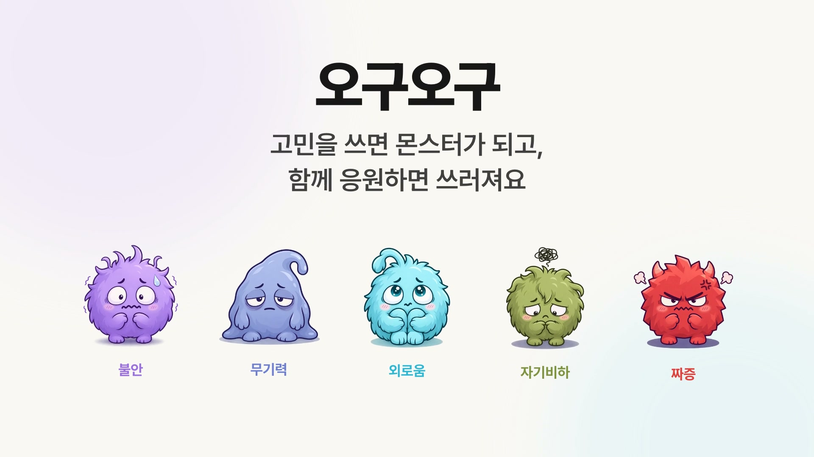
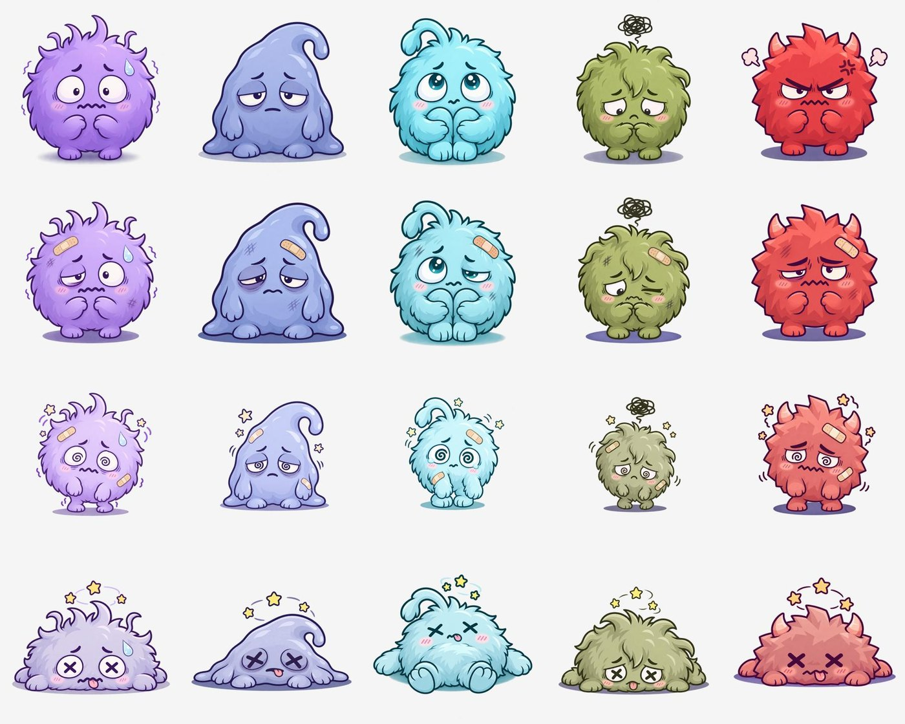
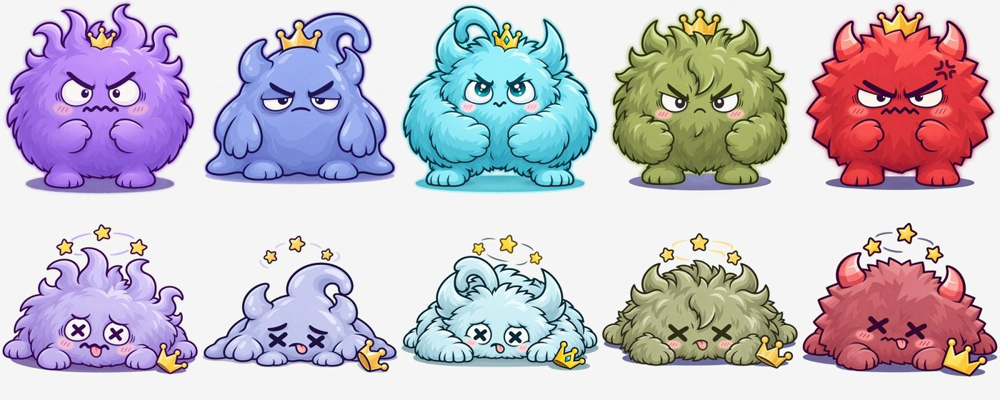
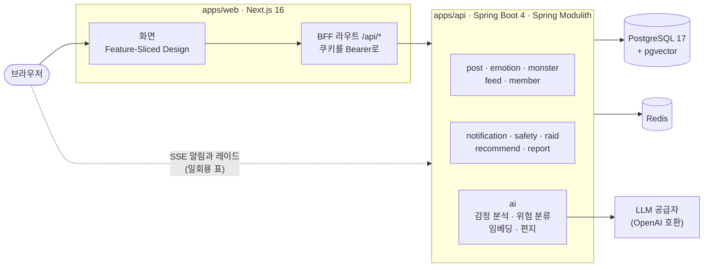

<div align="center">



# 🐾 오구오구 (5959)

### 감정을 나누고 함께 이겨내는 서비스

혼자 삼키기 어려운 고민을 익명으로 남기면<br>
AI가 감정을 읽어 몬스터로 만들고, 함께 응원하며 그 몬스터를 물리쳐요.

[](https://github.com/DDD-Community/DDD-13-WEBBB_BE)
[](https://github.com/DDD-Community/DDD-13-WEBBB-FE)

</div>

<br>

## 🎬 소개 영상

https://github.com/user-attachments/assets/66e48d11-21bb-498c-986b-3680f20c1de7

고민 한 줄이 불안 몬스터가 되고, 공감과 댓글이 HP를 깎고, 모두가 보스를 함께 물리치고, 월요일에 편지가 오기까지를 21초에 담았습니다.

<br>

## 🐾 이 저장소는

<a href="https://github.com/DDD-Community"></a>

오구오구는 개발자와 디자이너가 함께 사이드 프로젝트를 만드는 동아리 [DDD](https://github.com/DDD-Community)의 13기 WEBBB 팀이 만든 감정 공유 커뮤니티입니다. 저는 그 팀의 백엔드 개발자였고, 이 저장소에서 서비스를 처음부터 다시 만들었습니다. 원본의 기획만 이어받고 구조와 코드는 새로 썼습니다.

> 👤 **[장현호](https://github.com/hyunolike)** (DDD 13기 WEBBB 팀 백엔드)

- 다시 만든 코드는 [`apps/`](apps)에 있습니다. 여덟 개 마일스톤(M0~M7)을 스펙부터 쓰고 구현했습니다.
- 원본 서비스의 소개와 기술 스택, 구조, 팀원은 [원본 서비스 문서](docs/original-service.md)로 옮겼습니다. 원본 코드는 [`webbb-be/`](webbb-be)와 [`webbb-fe/`](webbb-fe)에 참고용으로 들어 있습니다.

<br>

## 👾 몬스터

고민마다 감정에 맞는 몬스터가 생깁니다. 응원을 받아 HP가 줄면 네 단계로 지쳐 가다 쓰러집니다. 감정 5종에 단계 4개, 모두 20장입니다.



레이드 보스는 감정마다 따로 그렸습니다.



그림은 이미지 생성 도구로 만들었습니다. 한 장을 먼저 그려 화풍을 정하고, 그 그림을 참고로 넘겨 나머지를 그려 캐릭터를 맞췄습니다. 처음에는 코드로 그린 3D였다가 바꾼 까닭은 [ADR-0006](docs/adr/0006-illustrated-monsters.md)에 있습니다.

<br>

## ✨ 할 수 있는 것

| 기능 | 무엇을 하나 | 스펙 |
| --- | --- | --- |
| 고민 쓰기와 몬스터 | 글을 쓰면 AI가 감정을 읽어 몬스터를 만듭니다. 공감은 HP 1, 첫 댓글은 HP 3을 깎습니다 | [003](specs/003-core-loop/spec.md) |
| 알림과 마이페이지 | 댓글, 공감, 처치를 새로고침 없이 알려 줍니다. 내 글과 감정 통계를 다시 봅니다 | [004](specs/004-notification-mypage/spec.md) |
| 위험 감지와 안전장치 | 위기 신호가 있는 글은 숨기고 작성자에게 도움받을 곳을 안내합니다. 신고와 욕설 가리기가 있습니다 | [005](specs/005-safety/spec.md) |
| 보스 레이드 | 모든 회원이 보스 한 마리를 함께 공격합니다. 다른 회원의 공격이 바로 HP에 보입니다 | [006](specs/006-raid/spec.md) |
| 비슷한 고민 추천 | 글 아래에 비슷한 다른 회원의 고민을 보여 줍니다 | [007](specs/007-recommend/spec.md) |
| 주간 리포트 | 월요일에 지난주의 감정과 받은 응원을 돌아보고, AI가 쓴 짧은 편지를 받습니다 | [008](specs/008-weekly-report/spec.md) |
| 가입과 로그인 | 이메일과 카카오, 구글 로그인. 토큰은 브라우저 스크립트가 읽지 못하는 쿠키에만 둡니다 | [002](specs/002-auth/spec.md) |

기능마다 어떻게 만들었고 무엇을 쟀는지는 [기능별 설명](docs/features.md)에 풀어 썼습니다.

<br>

## 🏛 어떻게 만들었나


```mermaid
flowchart LR
    U([브라우저])

    subgraph Web["apps/web · Next.js 16"]
        Pages["화면<br/>Feature-Sliced Design"]
        BFF["BFF 라우트 /api/*<br/>쿠키를 Bearer로"]
    end

    subgraph Api["apps/api · Spring Boot 4 · Spring Modulith"]
        direction TB
        Core["post · emotion · monster<br/>feed · member"]
        More["notification · safety · raid<br/>recommend · report"]
        AI["ai<br/>감정 분석 · 위험 분류<br/>임베딩 · 편지"]
    end

    PG[("PostgreSQL 17<br/>+ pgvector")]
    Redis[("Redis")]
    LLM["LLM 공급자<br/>(OpenAI 호환)"]

    U --> Pages --> BFF --> Api
    U -. "SSE 알림과 레이드<br/>(일회용 표)" .-> Api
    Api --> PG
    Api --> Redis
    AI --> LLM
```

설계에서 지키려 한 것은 네 가지입니다.

- **AI가 내려가도 핵심 흐름은 돕니다.** 감정 분석, 위험 분류, 임베딩, 편지는 모두 글 저장이 끝난 뒤에 따로 돌고, 실패하면 간격을 늘려 다시 시도합니다. AI 없이도 글쓰기, 키워드 위험 감지, 리포트 발행은 그대로 됩니다.
- **위기 글은 한 번도 공개되지 않습니다.** 목록에 있는 위기 표현은 글 저장과 같은 트랜잭션에서 걸러 숨깁니다. 숨김 규칙은 피드, 추천, 알림이 모두 한곳의 조건을 씁니다.
- **모듈의 경계를 테스트가 지킵니다.** 모듈 12개가 정해진 방향으로만 의존하고, 다른 모듈의 테이블을 직접 읽지 않습니다. 어기면 `ModularityTests`가 실패합니다.
- **"한 번만"은 잠금이 아니라 제약이 지킵니다.** 살아 있는 보스 하나, 회원과 주마다 리포트 하나, 알림 하나를 유일 제약과 멱등 키로 보장합니다.

전체 설계는 [아키텍처 문서](docs/architecture/overview.md)에, 결정과 그 까닭은 [ADR](docs/adr)에 있습니다.

<br>

## 📏 재 본 것

| 무엇을 | 결과 |
| --- | --- |
| 레이드: 가상 사용자 500명이 동시에 공격 | HP 갱신 유실 0건, 처치 기록 1건, 공격 응답 p95 233ms ([기록](docs/benchmarks/raid-attack.md)) |
| 추천: 글 1만 건에서 조회 | p95 62ms |
| 주간 리포트: 1천 명 가운데 100명을 실패하게 함 | 첫 실행에 900명, 다음 실행에 100명. 겹친 리포트와 알림 0건 |
| 위기 글 100개를 쓰는 동안 다른 회원이 피드를 계속 조회 | 20번 되풀이해 한 번도 보이지 않음 |
| 글 쓰기(키워드 위험 판정 포함) | p95 21ms |
| 자동 테스트 | API 1,055개, 웹 단위 993개, 브라우저 e2e 94개 |

성능 수치는 모두 로컬 한 기기에서 쟀습니다. 운영 환경의 수치가 아닙니다.

### 아직 목표에 못 미친 것

숨기지 않고 적어 둡니다. 측정과 해 본 것은 각 스펙의 `research.md`에 있습니다.

- **위기 감지**: 직접 쓴 평가 문장의 92%를 잡지만, 에두른 표현만 모은 묶음에서는 40~45%입니다. 목표는 놓치는 비율 5% 이하입니다.
- **추천 품질**: 추천에 같은 주제가 든 비율이 35%입니다(목표 80%). 지금 쓰는 임베딩 모델이 한국어 고민의 주제를 잘 가르지 못합니다. 아주 가까운 글만 "비슷한 고민"으로 보이게 기준을 좁혀 두었습니다.
- **리포트를 만드는 동안의 글 쓰기**: p95가 26ms에서 46ms로 늘어납니다.

<br>

## 🛠 기술 스택

| 구분 | 사용 기술 |
| --- | --- |
| API | Kotlin 2.2, JDK 21, Spring Boot 4.1, Spring Modulith 2.1 |
| 데이터 | PostgreSQL 17 + pgvector, Redis(Lua 스크립트, pub/sub), Flyway |
| AI | Spring AI(OpenAI 호환 공급자), Resilience4j 서킷 브레이커 |
| 웹 | Next.js 16(App Router), React 19, TypeScript, Tailwind CSS v4 |
| 웹 상태 | TanStack Query v5, Zustand v5, react-hook-form, Zod |
| 실시간 | Server-Sent Events(알림, 레이드) |
| 테스트 | JUnit 5, Testcontainers, Vitest, Playwright, k6 |
| 품질 | ktlint, detekt, ESLint, Prettier, steiger(FSD 규칙) |
| 진행 방식 | GitHub Spec Kit(스펙 → 설계 → 작업 → 구현), OpenAPI 계약 우선 |
| CI | GitHub Actions(API, 웹, 실제 API를 띄운 e2e), release-please |

<br>

## 📁 저장소 구성

```
.
├── apps/
│   ├── api/        Kotlin, Spring Boot 4, Spring Modulith
│   └── web/        Next.js 16, Feature-Sliced Design
├── contracts/      OpenAPI 계약 (웹의 타입을 여기서 만든다)
├── specs/          기능별 스펙, 설계, 작업 목록 (001~008)
├── docs/           아키텍처, ADR, 측정 기록
├── infra/          운영 compose, Caddy, 백업과 부하 테스트 스크립트
├── webbb-be/       원본 백엔드 (참고용)
└── webbb-fe/       원본 프론트엔드 (참고용)
```

<br>

## 🚀 로컬 실행

```bash
cd apps/api && ./gradlew bootRun        # PostgreSQL과 Redis는 compose로 자동 기동
pnpm install && pnpm --filter web dev   # http://localhost:3000
```

AI 키(`AI_API_KEY`)가 없으면 글이 "분석 중"에 머물고 몬스터가 생기지 않습니다. 키 없이 둘러보려면 API를 가짜 분석기로 띄웁니다. 본문 앞의 `[불안:높음]` 같은 머리말로 감정을 정합니다.

```bash
cd apps/api && SPRING_PROFILES_ACTIVE=local,e2e ./gradlew bootRun
```

<br>

## 📚 문서

| 문서 | 내용 |
| --- | --- |
| [기능별 설명](docs/features.md) | 기능마다 무엇을 하고 어떻게 만들었는지 |
| [아키텍처](docs/architecture/overview.md) | 로드맵, 시스템 구조, 모듈, 측정 목표 |
| [결정 기록(ADR)](docs/adr) | 모듈러 모놀리스, BFF 인증, 몬스터 그림 등 여섯 가지 결정 |
| [스펙](specs) | 마일스톤마다의 요구사항, 설계, 검증 절차 |
| [개발 원칙](.specify/memory/constitution.md) | 여섯 가지 원칙 |
| [API 가이드](apps/api/AGENTS.md), [웹 구조](apps/web/docs/ARCHITECTURE.md) | 모듈과 슬라이스마다의 규칙 |
| [레이드 부하 테스트](docs/benchmarks/raid-attack.md) | 가상 사용자 500명 측정 기록 |
| [원본 서비스](docs/original-service.md) | DDD 13기 WEBBB 팀의 원본 소개, 기술 스택, 구조, 팀원 |

<br>

## 👥 원본 프로젝트

<a href="https://github.com/DDD-Community"></a>

오구오구의 기획과 원본 서비스는 [DDD](https://github.com/DDD-Community) 13기 WEBBB 팀이 함께 만들었습니다. 팀원과 원본의 구조는 [원본 서비스 문서](docs/original-service.md#-원본-프로젝트-멤버)에 있습니다.
