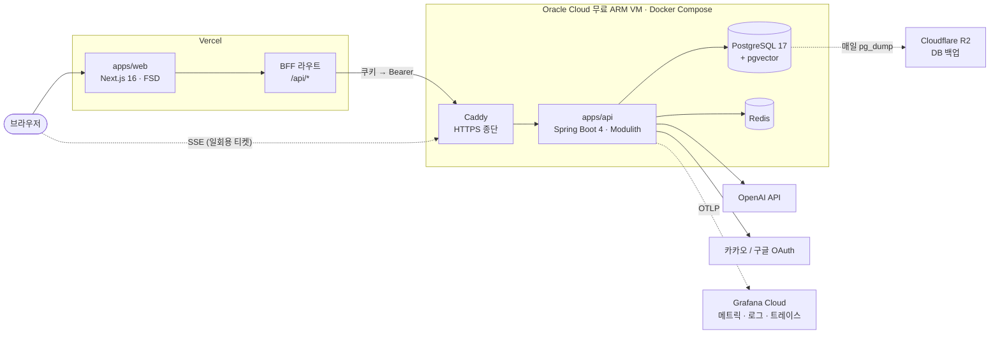
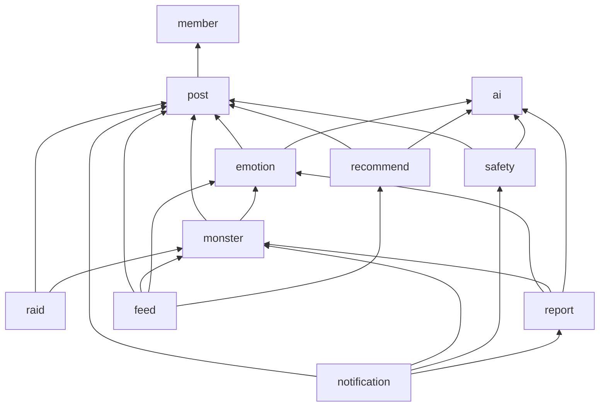
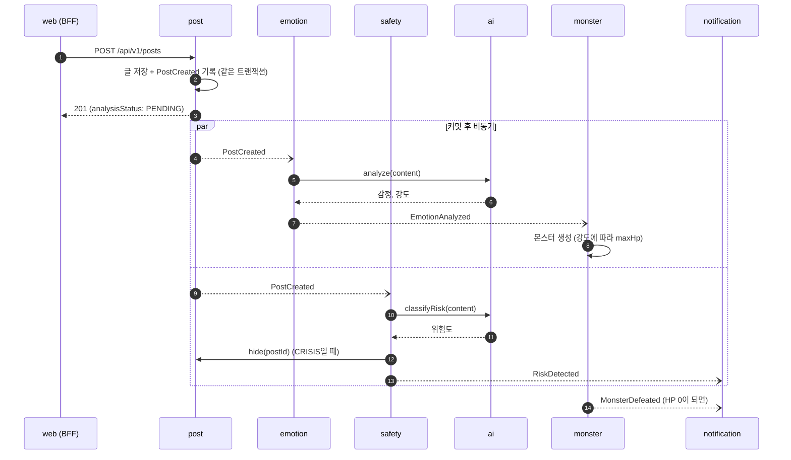
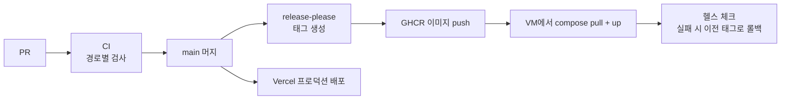

# 오구오구 재구축 설계

- 작성일: 2026-09-24
- 상태: 검토 중
- 참고 템플릿: [kotlin-spring-modulith-template](https://github.com/hyunolike/kotlin-spring-modulith-template), [nextjs-fsd-template](https://github.com/hyunolike/nextjs-fsd-template)
- 참고 원본: `webbb-be/`, `webbb-fe/` (DDD 13기 WEBBB, git subtree)

## 1. 목적

DDD 13기에서 만든 오구오구를 두 템플릿 구조 위에서 다시 만들고, 새 기능 네 가지를 더한다.
결과물은 채용 포트폴리오로 쓴다. 그래서 기능 수보다 **설계 판단을 코드와 테스트로 증명하는 것**을 우선한다.

### 성공 기준

1. 채용 담당자가 운영 URL에 접속해 글 작성부터 몬스터 처치까지 직접 해볼 수 있다.
2. 아키텍처 규칙(모듈 경계, FSD 레이어, API 계약)을 CI가 강제한다. 규칙을 어기면 머지할 수 없다.
3. 스펙의 인수 조건마다 대응하는 테스트가 있고, ID로 추적할 수 있다.
4. 마일스톤마다 측정한 수치가 README에 남는다(11장).
5. 월 인프라 비용이 OpenAI 사용료를 빼면 0원이다.

### 범위 밖

- 네이티브 앱, 다국어, 관리자 백오피스(신고 처리는 DB와 API로만 한다)
- 마이크로서비스 분리, Kafka 같은 외부 메시지 브로커
- 원본 캐릭터 그림 재사용 (감정 5종이라는 개념만 이어받는다)

## 2. 원칙 (constitution 초안)

Spec Kit의 `constitution.md`로 옮길 원칙이다. 모든 스펙과 plan은 이 원칙에 비춰 검토한다.

1. **경계는 테스트로 강제한다.** 백엔드 모듈 경계는 `ApplicationModules.verify()`, 프론트엔드 레이어는 steiger가 검사한다.
2. **계약이 코드보다 먼저다.** API는 스펙의 `contracts/openapi.yaml`을 먼저 쓰고 구현한다.
3. **인수 조건은 곧 테스트다.** 인수 조건 ID(`US1-AC2`)를 테스트 이름에 넣는다.
4. **사용자 안전이 기능보다 먼저다.** 위험 신호 감지는 사용자 수를 늘리는 기능보다 먼저 출시한다.
5. **AI 장애가 핵심 흐름을 막지 않는다.** AI 호출은 모두 비동기 이벤트 뒤에 두고, 실패해도 글 작성은 성공한다.
6. **무료 인프라 안에서 운영한다.** 비용이 드는 선택은 ADR로 근거를 남긴다.

## 3. 마일스톤

마일스톤 하나가 Spec Kit 스펙 하나(`specs/NNN-이름/`)다. 마일스톤이 끝날 때마다 운영 환경에 배포한다.

| # | 스펙 | 핵심 기능 | 보여 줄 역량 |
|---|---|---|---|
| M0 | `001-foundation` | 모노레포, constitution, CI, 배포 파이프라인, 관측성 | SDD 운영, CI/CD, 규칙 강제 |
| M1 | `002-auth` | 이메일 가입과 로그인, OAuth(카카오, 구글), JWT, 온보딩 | 보안, BFF |
| M2 | `003-core-loop` | 고민 작성, AI 감정 분석, 몬스터 생성, 댓글과 공감으로 HP 감소, 처치 | 이벤트 기반 비동기, 장애 격리 |
| M3 | `004-notification-mypage` | SSE 알림, 내 글, 공감한 글, 감정 통계 | 실시간 전송, 조회 모델 |
| M4 | `005-safety` | 위험 신호 감지, 도움 리소스 안내, 신고, 욕설 마스킹 | 이벤트 신뢰성, 서비스 책임 |
| M5 | `006-raid` | 여러 사용자가 보스 몬스터 하나를 함께 공격, 실시간 HP 동기화 | 동시성 제어, 부하 테스트 |
| M6 | `007-recommend` | 감정 임베딩 기반 비슷한 고민 추천 | 벡터 검색 |
| M7 | `008-weekly-report` | 주간 감정 집계, AI 편지, 차트 | 배치, 집계 쿼리, 시각화 |

M4를 M5보다 앞에 둔 이유: 감정 커뮤니티에서 가장 큰 위험은 위기 신호를 놓치는 것이다. 사용자 참여를 늘리는 레이드보다 안전장치를 먼저 갖춘다.

## 4. 시스템 구조



### 저장소 구성

```
.
├── apps/
│   ├── api/          Kotlin · Spring Boot 4 · Spring Modulith
│   └── web/          Next.js 16 · FSD
├── specs/            Spec Kit 스펙 (기능별 폴더)
├── .specify/         Spec Kit 설정, constitution, 템플릿
├── docs/
│   ├── architecture/ 이 문서
│   └── adr/          결정 기록
├── infra/            compose.prod.yaml, Caddyfile, 백업 스크립트
├── webbb-be/         원본 (참고용, 수정하지 않음)
└── webbb-fe/         원본 (참고용, 수정하지 않음)
```

## 5. 백엔드 (apps/api)

템플릿 구성을 그대로 따른다: Kotlin 2.2, Spring Boot 4.1, Spring Modulith 2.1, JDK 21, PostgreSQL, Flyway, ktlint, detekt, Testcontainers.
루트 패키지는 `com.ogu`이다.

### 5.1 모듈

각 모듈은 루트 패키지에 파사드 인터페이스, 공개 DTO, 이벤트만 노출한다. `application`, `domain`, `presentation`은 숨긴다.

| 모듈 | 책임 | 공개 파사드 | 발행 이벤트 | 구독 이벤트 |
|---|---|---|---|---|
| `shared` (OPEN) | 공통 응답, 예외, 설정 | - | - | - |
| `member` | 회원, 인증, OAuth, 토큰 | `MemberApi` | `MemberWithdrawn` | - |
| `post` | 고민 글, 댓글, 공감, 숨김 처리 | `PostApi` | `PostCreated`, `CommentCreated`, `PostLiked`, `CommentLiked` | - |
| `ai` | LLM 게이트웨이 (Spring AI, Resilience4j, 요청 제한) | `EmotionAnalyzer`, `Embedder`, `RiskClassifier`, `LetterWriter` | - | - |
| `emotion` | 감정 분석 결과, 감정 통계 | `EmotionApi` | `EmotionAnalyzed` | `PostCreated` |
| `monster` | 몬스터 생성, HP, 처치 | `MonsterApi` | `MonsterDefeated` | `EmotionAnalyzed`, `CommentCreated`, `PostLiked`, `CommentLiked` |
| `safety` | 위험 감지, 신고, 욕설 마스킹. 위험 글은 `PostApi.hide()`로 숨긴다 | `SafetyApi` | `RiskDetected` | `PostCreated`, `CommentCreated` |
| `raid` | 보스 몬스터, 동시 공격 | `RaidApi` | `RaidBossDefeated` | `CommentCreated` |
| `recommend` | 임베딩 저장, 유사 글 검색 | `RecommendApi` | - | `PostCreated` |
| `report` | 주간 리포트 배치 | `ReportApi` | `WeeklyReportPublished` | - |
| `notification` | SSE 알림, 알림 이력 | - | - | `CommentCreated`, `MonsterDefeated`, `RiskDetected`, `WeeklyReportPublished` |
| `feed` | 피드, 글 상세, 마이페이지 조회 조합 | - (HTTP API만) | - | - |

의존 방향은 한쪽으로만 흐른다. Spring Modulith는 다른 모듈의 이벤트 타입을 참조하는 것도 의존으로 보므로, 이벤트 구독도 아래 방향을 따라야 한다.



- `post`는 `member` 말고는 어떤 도메인 모듈도 모른다. 글에 몬스터 HP나 감정을 붙여 보여 주는 일은 `feed` 모듈이 각 파사드를 불러 조합한다.
- `ai`는 도메인 모듈을 모른다.
- 순환이 생기면 `ModularityTests`가 실패한다.

### 5.2 핵심 흐름 (M2)



- 이벤트는 `@ApplicationModuleListener`로 받는다. 커밋이 끝난 뒤 비동기로, 새 트랜잭션에서 실행된다.
- Event Publication Registry가 이벤트를 `event_publication` 테이블에 기록한다. 리스너가 실패하면 미완료로 남고, 스케줄러가 재발행한다.
- AI 호출은 Resilience4j로 재시도와 서킷 브레이커를 건다. 서킷이 열리면 즉시 실패시키고 이벤트는 미완료로 남긴다.
- 분석이 끝나기 전에는 글의 `analysisStatus`가 `PENDING`이다. 프론트엔드는 "분석 중" 상태를 보여 주고, 끝나면 SSE로 갱신한다.

### 5.3 HP 규칙

원본 규칙을 기본값으로 이어받는다. 수치는 M2 스펙에서 확정한다.

- 감정 강도에 따라 `maxHp`는 10, 20, 30 중 하나다.
- 글 공감은 HP를 1 줄인다. 댓글과 댓글 공감의 감소량은 M2 스펙에서 정한다.
- 같은 사용자가 같은 글에 여러 번 반응해도 행동 종류마다 한 번만 반영한다.
- HP 변화는 `monster_hp_log`에 남긴다. 감정 통계와 주간 리포트가 이 이력을 쓴다.

### 5.4 레이드 동시성 (M5)

- 보스 몬스터 HP는 Redis에 두고, 공격은 Lua 스크립트로 원자적으로 감소시킨다. 0 아래로 내려가지 않게 하고, 처치 이벤트가 정확히 한 번만 나가게 한다.
- Postgres에는 공격 로그를 비동기로 쌓아 두고, 주기적으로 HP 스냅샷을 동기화한다. Redis가 재시작되면 스냅샷과 로그로 복구한다.
- HP 변화는 SSE로 전달하되, 초당 최대 4회로 묶어서 보낸다.
- k6로 동시 공격 부하 테스트를 하고 결과를 `docs/benchmarks/`에 남긴다.

### 5.5 추천 (M6)

- 글이 작성되면 `recommend` 모듈이 임베딩을 만들어 pgvector 컬럼에 저장한다. 임베딩 모델은 `text-embedding-3-small`(1536차원)을 쓴다.
- 비슷한 고민은 코사인 거리 기준 상위 N개를 HNSW 인덱스로 찾는다. 본인 글과 숨김 처리된 글은 뺀다.

### 5.6 위험 감지 (M4)

- 글과 댓글을 AI로 분류해 위험도를 `NONE`, `CONCERN`, `CRISIS` 세 단계로 나눈다.
- `CRISIS`면 작성자에게 도움 리소스(자살예방상담전화 109 등)를 바로 안내하고, 글은 공개 피드에서 숨긴다.
- AI 분류가 실패하면 키워드 규칙으로 대신 판단한다. 안전 판단은 AI 장애 때문에 빠지면 안 되기 때문이다.
- 위험 감지 결과와 신고는 DB에 기록하고, 처리 API를 둔다.

### 5.7 주간 리포트 (M7)

- 매주 월요일 새벽에 스케줄러가 지난주 감정 분포, 처치한 몬스터 수, 받은 공감 수를 사용자별로 집계한다.
- AI가 집계를 바탕으로 짧은 편지를 쓴다. 한 사용자의 실패가 전체 배치를 멈추지 않도록 사용자 단위로 처리하고, 실패한 사용자만 재시도한다.
- 여러 인스턴스로 늘어날 때를 대비해 스케줄 중복 실행은 ShedLock으로 막는다.

### 5.8 공통

- 응답 포맷은 템플릿의 `ApiResponse<T>`를 쓰고, 오류는 `ErrorCode`로 관리한다.
- API 경로는 `/api/v1/**`이다.
- 요청 ID를 MDC와 트레이스 ID로 이어서 로그와 트레이스를 서로 찾을 수 있게 한다.
- 사용자별 요청 제한은 Bucket4j와 Redis로 건다. AI를 호출하는 쓰기 API에 먼저 적용한다.

## 6. 프론트엔드 (apps/web)

템플릿 구성을 그대로 따른다: Next.js 16, React 19, TypeScript strict, Tailwind CSS 4, TanStack Query 5, Zustand 5, React Hook Form과 Zod, steiger, Vitest, Playwright.

### 6.1 FSD 레이어

```
src/
├── app/        라우트 조립만: (auth), feed, post/[id], raid, report, my
├── core/       Provider, 세션 부트스트랩, 전역 스타일
├── widgets/    feed-list, post-detail, raid-arena, weekly-report, safety-banner
├── features/   write-post, comment, like, raid-attack, report-post, auth/*
├── entities/   post, monster, emotion, user, notification, report
└── shared/     UI 키트, API 클라이언트, 생성된 API 타입, env
```

import는 아래 방향으로만 한다. 같은 레이어의 슬라이스끼리는 import하지 않고 한 레이어 위에서 조립한다. 슬라이스는 `index.ts`로만 공개한다.

### 6.2 3D 몬스터 (entities/monster)

React Three Fiber로 몬스터를 코드로 만든다. 원본 그림은 쓰지 않고, 감정 5종(불안, 무기력, 외로움, 자기비하, 짜증)이라는 개념만 이어받는다.

- `model/appearance.ts`: `(감정, HP 비율, 상태) → 외형 파라미터`를 계산하는 순수 함수다. 색, 크기, 흔들림, 금 간 정도를 돌려준다. 렌더링과 분리해서 Vitest로 테스트한다.
- `ui/monster-3d.tsx`: R3F 장면이다. `next/dynamic`으로 글 상세와 레이드 화면에서만 불러온다. 첫 로딩 번들에 Three.js가 들어가지 않게 한다.
- `ui/monster-sprite.tsx`: 목록용 정지 이미지다. `scripts/render-monsters.ts`가 Playwright로 3D 장면을 캡처해 감정 5종 × 상태별 PNG를 만든다.
- WebGL을 쓸 수 없거나 `prefers-reduced-motion`이 켜진 기기에서는 정지 이미지로 대체한다.
- 감정마다 색, 형태, 움직임으로 구분한다. 예를 들어 불안은 떨리는 뾰족한 형태, 무기력은 축 처진 형태로 표현한다. 레이드 보스는 같은 모델을 키우고 파티클을 더한다.

### 6.3 인증: BFF

- access 토큰과 refresh 토큰을 모두 httpOnly 쿠키에 둔다. 브라우저 스크립트는 토큰을 읽을 수 없다.
- 브라우저는 같은 출처의 `/api/*`만 호출한다. Next.js 라우트 핸들러가 쿠키를 `Authorization: Bearer`로 바꿔 백엔드에 전달하고, 401이면 한 번 refresh한 뒤 다시 보낸다. 동시에 여러 요청이 401을 받아도 refresh는 한 번만 한다.
- 보호 경로는 `proxy.ts`가 렌더링 전에 세션 쿠키를 확인한다.
- **SSE는 예외다.** Vercel 함수는 실행 시간 제한이 있어 긴 연결을 중계하기 어렵다. BFF가 30초짜리 일회용 티켓을 발급하고, 브라우저가 티켓으로 API 도메인에 직접 연결한다. 끊기면 `Last-Event-ID`로 놓친 이벤트를 다시 받는다.

템플릿은 access 토큰을 localStorage에 두지만 여기서는 BFF를 택했다. 근거는 [ADR-0002](../adr/0002-bff-auth.md)에 있다.

### 6.4 상태 관리

- 서버 데이터는 TanStack Query가 맡는다. 조회 쿼리는 entity에, 사용자 행동의 mutation은 feature에 둔다. 공감처럼 즉시 반응이 중요한 곳은 낙관적 업데이트를 쓴다.
- Zustand는 서버 데이터가 아닌 전역 상태에만 쓴다. 세션 상태와 SSE 연결 상태가 여기에 해당한다.

## 7. API 계약

1. Spec Kit plan 단계에서 기능별 `specs/NNN/contracts/openapi.yaml`을 먼저 쓴다.
2. 백엔드는 springdoc이 만든 스펙이 계약과 일치하는지 테스트로 확인한다.
3. 프론트엔드는 `openapi-typescript`로 `shared/api/generated.ts`를 만든다. 계약이 바뀌었는데 다시 생성하지 않았으면 CI가 실패한다.
4. 백엔드가 준비되기 전에는 MSW로 계약 기반 목(mock)을 띄워 프론트엔드가 먼저 진행한다.

## 8. 인프라와 운영

| 구성 요소 | 선택 | 이유 |
|---|---|---|
| 프론트엔드 | Vercel Hobby | PR 프리뷰, 무료 |
| 백엔드 서버 | Oracle Cloud 무료 ARM VM (4 OCPU, 24GB) | API, Postgres, Redis를 한 대에 올려도 여유가 있다 |
| 리버스 프록시 | Caddy | HTTPS 인증서 자동 발급 |
| DB | VM 안의 PostgreSQL 17 + pgvector | [ADR-0004](../adr/0004-self-hosted-postgres.md) |
| 백업 | 매일 `pg_dump` → Cloudflare R2, 14일 보관 | 복구 절차를 `infra/RESTORE.md`로 문서화하고 분기마다 복구 연습 |
| 이미지 저장소 | GHCR | GitHub Actions와 연동 |
| 관측성 | OpenTelemetry → Grafana Cloud 무료, 프론트엔드는 Sentry 무료 | VM에 모니터링 스택을 띄우지 않는다 |
| 비밀값 | GitHub Actions Secrets → VM `.env` | 저장소에 비밀값을 두지 않는다 |

### 배포 흐름



### 비용 통제

- OpenAI 계정에 월 사용 한도를 건다.
- 같은 글은 두 번 분석하지 않는다. 분석 결과는 글에 저장한다.
- AI를 부르는 API에 사용자별 요청 제한을 건다.

## 9. 품질 게이트

PR마다 CI에서 실행한다. 모노레포라 경로 필터로 바뀐 쪽만 돈다.

| 영역 | 검사 |
|---|---|
| 백엔드 | ktlint, detekt, `ModularityTests`, Testcontainers 통합 테스트, Kover 커버리지 리포트 |
| 프론트엔드 | `tsc --noEmit`, ESLint, steiger, Vitest, Playwright E2E |
| 계약 | 계약 파일, 백엔드 스펙, 프론트엔드 생성 타입 일치 여부 |
| 공통 | commitlint(Conventional Commits), Dependabot |

Spring Modulith `Documenter`가 만든 모듈 다이어그램은 CI 산출물로 올리고 README에서 링크한다.

## 10. SDD 운영 (GitHub Spec Kit)

1. `/speckit.constitution`으로 2장의 원칙을 등록한다.
2. 기능마다 `specify` → `clarify` → `plan` → `tasks` → `analyze` → `implement` 순서로 진행한다.
   - `plan` 산출물: `research.md`, `data-model.md`, `contracts/openapi.yaml`, `quickstart.md`
3. 브랜치 이름은 Spec Kit 규칙대로 `NNN-기능명`이다. PR 본문에 스펙 링크와 인수 조건 체크리스트를 넣는다.
4. **추적성**: 인수 조건에 `US{n}-AC{m}` ID를 붙이고 테스트 이름에 같은 ID를 넣는다.
   - 백엔드: `` fun `US1-AC2 AI 장애 중에도 글 작성은 성공한다`() ``
   - 프론트엔드: `test("US1-AC2 분석 중 상태를 보여 준다", ...)`
   - `grep -r "US1-AC2"`로 요구사항에서 테스트까지 바로 찾을 수 있다.
5. 큰 결정은 `docs/adr/`에 ADR로 남긴다.
6. 마일스톤이 끝나면 업무일지(`/worklog`)에 결과와 측정값을 기록한다.

## 11. 측정 목표

| 마일스톤 | 측정 항목 | 목표 |
|---|---|---|
| M2 | AI 장애 주입 중 글 작성 성공률 | 100%, 복구 후 밀린 이벤트 전부 재처리 |
| M3 | SSE 재연결 뒤 놓친 알림 | 0건 |
| M4 | AI 장애 중 위험 감지 | 키워드 규칙으로 계속 동작 |
| M5 | k6 가상 사용자 500명 동시 공격 | HP 갱신 유실 0건, p95 응답 시간 기록 |
| M6 | 추천 쿼리 | p95 응답 시간 기록 (글 1만 건 기준) |
| M7 | 주간 배치 | 일부 사용자가 실패해도 나머지는 완료 |

## 12. 위험과 대응

| 위험 | 대응 |
|---|---|
| Oracle 무료 VM 회수나 가용 용량 부족 | `infra/`에 compose와 프로비저닝 스크립트를 두어 다른 VM(EC2 등)으로 1시간 안에 옮길 수 있게 한다 |
| OpenAI 비용 급증 | 월 한도, 요청 제한, 결과 저장 |
| 위험 감지 오탐으로 멀쩡한 글이 숨겨짐 | `CRISIS`만 숨기고, 작성자에게 이유를 알리며, 재검토 API를 둔다 |
| 3D 렌더링이 저사양 기기에서 느림 | 목록은 정지 이미지, 상세만 3D, 폴백 제공 |
| 범위가 커서 끝나지 않음 | 마일스톤마다 배포한다. M4까지 끝나면 포트폴리오로 쓸 수 있게 순서를 잡았다 |

## 13. 결정 기록

- [ADR-0001 모듈러 모놀리스](../adr/0001-modular-monolith.md)
- [ADR-0002 BFF 인증](../adr/0002-bff-auth.md)
- [ADR-0003 R3F 코드 생성 3D 몬스터](../adr/0003-r3f-monsters.md)
- [ADR-0004 VM 내 PostgreSQL](../adr/0004-self-hosted-postgres.md)
