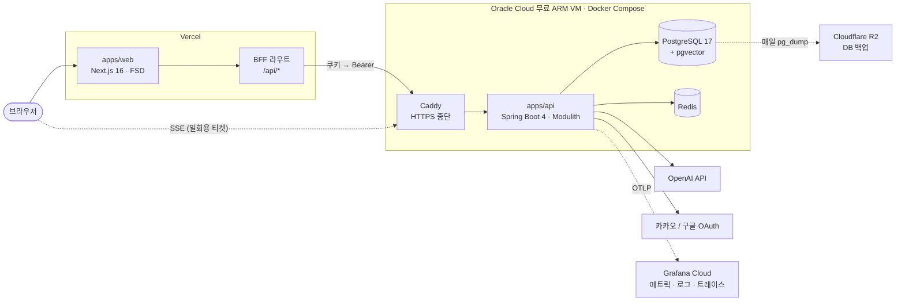
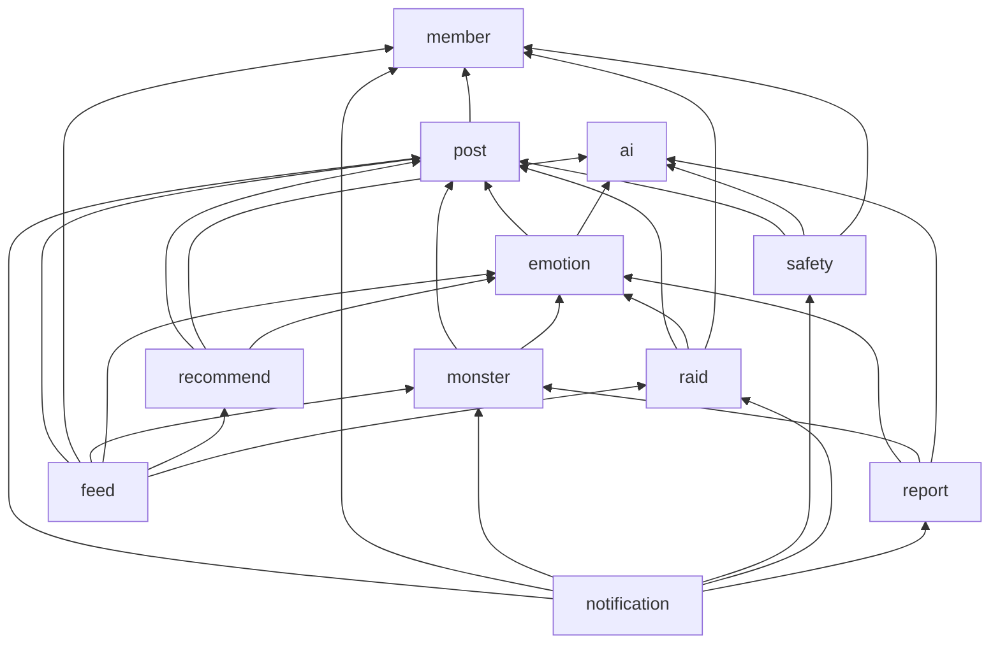
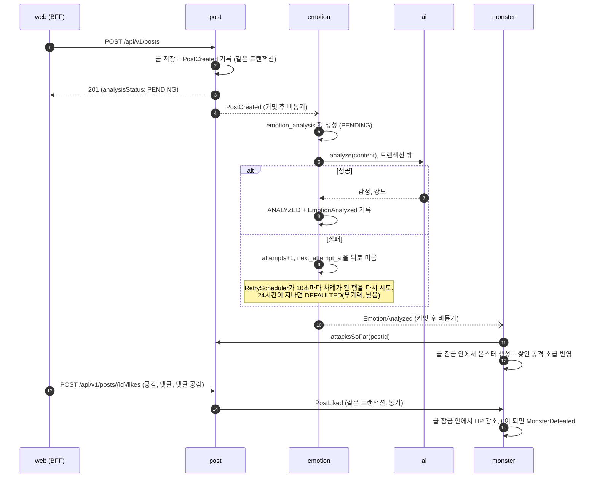
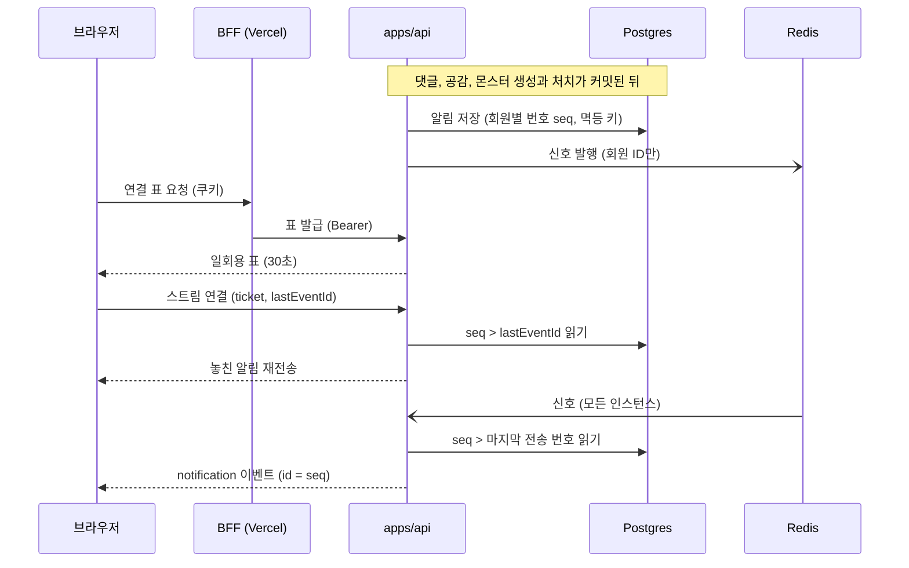
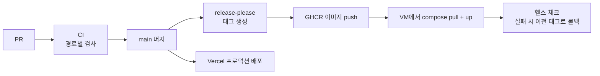

# 오구오구 재구축 설계

- 작성일: 2026-09-24
- 상태: 검토 중
- 참고 템플릿: [kotlin-spring-modulith-template](https://github.com/hyunolike/kotlin-spring-modulith-template), [nextjs-fsd-template](https://github.com/hyunolike/nextjs-fsd-template)
- 참고 원본: `webbb-be/`, `webbb-fe/` (DDD 13기 WEBBB, git subtree)

## 1. 목적

DDD 13기에서 만든 오구오구를 두 템플릿 구조 위에서 다시 만들고, 새 기능 네 가지를 더한다.
결과물은 채용 포트폴리오로 쓴다. 그래서 기능 수보다 **설계 판단을 코드와 테스트로 증명하는 것**을 우선한다.

### 성공 기준

1. 채용 담당자가 운영 URL에 접속해 글 작성부터 몬스터 처치까지 직접 해볼 수 있다.
2. 아키텍처 규칙(모듈 경계, FSD 레이어, API 계약)을 CI가 강제한다. 규칙을 어기면 머지할 수 없다.
3. 스펙의 인수 조건마다 대응하는 테스트가 있고, ID로 추적할 수 있다.
4. 마일스톤마다 측정한 수치가 README에 남는다(11장).
5. 월 인프라 비용이 OpenAI 사용료를 빼면 0원이다.

### 범위 밖

- 네이티브 앱, 다국어, 관리자 백오피스(신고 처리는 DB와 API로만 한다)
- 마이크로서비스 분리, Kafka 같은 외부 메시지 브로커
- 원본 캐릭터 그림 재사용 (감정 5종이라는 개념만 이어받는다)

## 2. 원칙 (constitution 초안)

Spec Kit의 `constitution.md`로 옮길 원칙이다. 모든 스펙과 plan은 이 원칙에 비춰 검토한다.

1. **경계는 테스트로 강제한다.** 백엔드 모듈 경계는 `ApplicationModules.verify()`, 프론트엔드 레이어는 steiger가 검사한다.
2. **계약이 코드보다 먼저다.** API는 스펙의 `contracts/openapi.yaml`을 먼저 쓰고 구현한다.
3. **인수 조건은 곧 테스트다.** 인수 조건 ID(`US1-AC2`)를 테스트 이름에 넣는다.
4. **사용자 안전이 기능보다 먼저다.** 위험 신호 감지는 사용자 수를 늘리는 기능보다 먼저 출시한다.
5. **AI 장애가 핵심 흐름을 막지 않는다.** AI 호출은 모두 비동기 이벤트 뒤에 두고, 실패해도 글 작성은 성공한다.
6. **무료 인프라 안에서 운영한다.** 비용이 드는 선택은 ADR로 근거를 남긴다.

## 3. 마일스톤

마일스톤 하나가 Spec Kit 스펙 하나(`specs/NNN-이름/`)다. 마일스톤이 끝날 때마다 운영 환경에 배포한다.

| # | 스펙 | 핵심 기능 | 보여 줄 역량 |
|---|---|---|---|
| M0 | `001-foundation` | 모노레포, constitution, CI, 배포 파이프라인, 관측성 | SDD 운영, CI/CD, 규칙 강제 |
| M1 | `002-auth` | 이메일 가입과 로그인, OAuth(카카오, 구글), JWT, 온보딩 | 보안, BFF |
| M2 | `003-core-loop` | 고민 작성, AI 감정 분석, 몬스터 생성, 댓글과 공감으로 HP 감소, 처치 | 이벤트 기반 비동기, 장애 격리 |
| M3 | `004-notification-mypage` | SSE 알림, 내 글, 공감한 글, 감정 통계 | 실시간 전송, 조회 모델 |
| M4 | `005-safety` | 위험 신호 감지, 도움 리소스 안내, 신고, 욕설 마스킹 | 이벤트 신뢰성, 서비스 책임 |
| M5 | `006-raid` | 여러 사용자가 보스 몬스터 하나를 함께 공격, 실시간 HP 동기화 | 동시성 제어, 부하 테스트 |
| M6 | `007-recommend` | 감정 임베딩 기반 비슷한 고민 추천 | 벡터 검색 |
| M7 | `008-weekly-report` | 주간 감정 집계, AI 편지, 차트 | 배치, 집계 쿼리, 시각화 |

M4를 M5보다 앞에 둔 이유: 감정 커뮤니티에서 가장 큰 위험은 위기 신호를 놓치는 것이다. 사용자 참여를 늘리는 레이드보다 안전장치를 먼저 갖춘다.

## 4. 시스템 구조


```mermaid
flowchart LR
    U([브라우저])

    subgraph Vercel
        Web["apps/web<br/>Next.js 16 · FSD"]
        BFF["BFF 라우트<br/>/api/*"]
    end

    subgraph VM["Oracle Cloud 무료 ARM VM · Docker Compose"]
        Caddy["Caddy<br/>HTTPS 종단"]
        API["apps/api<br/>Spring Boot 4 · Modulith"]
        PG[("PostgreSQL 17<br/>+ pgvector")]
        Redis[("Redis")]
    end

    OpenAI["OpenAI API"]
    OAuth["카카오 / 구글 OAuth"]
    R2["Cloudflare R2<br/>DB 백업"]
    Grafana["Grafana Cloud<br/>메트릭 · 로그 · 트레이스"]

    U --> Web --> BFF -- "쿠키 → Bearer" --> Caddy --> API
    U -. "SSE (일회용 티켓)" .-> Caddy
    API --> PG
    API --> Redis
    API --> OpenAI
    API --> OAuth
    PG -. "매일 pg_dump" .-> R2
    API -. OTLP .-> Grafana
```

Redis는 M3(004)에서 들어왔다. 실시간 알림의 인스턴스 간 pub/sub 신호만 나르고 아무것도 저장하지 않는다(메모리 상한 64MB, 영속화 없음). 알림 내용은 언제나 Postgres에서 읽으므로 Redis가 내려가도 알림은 저장되고, 안전망 주기와 재연결로 전달된다. API도 Redis 없이 뜬다.

### 저장소 구성

```
.
├── apps/
│   ├── api/          Kotlin · Spring Boot 4 · Spring Modulith
│   └── web/          Next.js 16 · FSD
├── specs/            Spec Kit 스펙 (기능별 폴더)
├── .specify/         Spec Kit 설정, constitution, 템플릿
├── docs/
│   ├── architecture/ 이 문서
│   └── adr/          결정 기록
├── infra/            compose.prod.yaml, Caddyfile, 백업 스크립트
├── webbb-be/         원본 (참고용, 수정하지 않음)
└── webbb-fe/         원본 (참고용, 수정하지 않음)
```

## 5. 백엔드 (apps/api)

템플릿 구성을 그대로 따른다: Kotlin 2.2, Spring Boot 4.1, Spring Modulith 2.1, JDK 21, PostgreSQL, Flyway, ktlint, detekt, Testcontainers.
루트 패키지는 `com.ogu`이다.

이벤트 저장소는 `spring-modulith-starter-jdbc`를 쓰고 스키마는 Flyway V1에서 만든다.

### 5.1 모듈

각 모듈은 루트 패키지에 파사드 인터페이스, 공개 DTO, 이벤트만 노출한다. `application`, `domain`, `presentation`은 숨긴다.

| 모듈 | 책임 | 공개 파사드 | 발행 이벤트 | 구독 이벤트 |
|---|---|---|---|---|
| `shared` (OPEN) | 공통 응답, 예외, 설정 | - | - | - |
| `member` | 회원, 인증(이메일/카카오/구글), 로그인 실패 제한, 세션(JWT access·refresh), 프로필 수정, 실시간 알림 연결 표 | `MemberApi`(회원 조회, 연결 표 발급 `issueStreamTicket`과 소비 `consumeStreamTicket`) | `MemberWithdrawn`(회원 탈퇴는 M1 범위 밖이라 아직 발행하지 않는다) | - |
| `post` | 고민 글, 댓글, 공감, 숨김 상태와 위험 단계의 열 | `PostApi`, `PostActivityApi`(회원 한 명의 글, 댓글, 공감 조회), `PostModerationApi`(`safety`만 쓴다. 판정할 원문 읽기, 숨기기와 풀기) | `PostCreated`, `CommentCreated`, `PostLiked`, `CommentLiked`, `PostWritten`, `CommentWritten`, `PostRemoved`, `CommentRemoved` | - |
| `ai` | LLM 게이트웨이 (Spring AI, Resilience4j, 요청 제한) | `EmotionAnalyzer`(M2), `RiskClassifier`(M4). `Embedder`, `LetterWriter`는 뒤 마일스톤 | - | - |
| `emotion` | 감정 분석 결과 | `EmotionApi` | `EmotionAnalyzed` | `PostCreated` |
| `monster` | 몬스터 생성, HP, 처치 | `MonsterApi` | `MonsterSpawned`, `MonsterDefeated` | `EmotionAnalyzed`(커밋 후 비동기), `PostLiked`, `CommentCreated`, `CommentLiked`(post 트랜잭션 안에서 동기) |
| `safety` | 위험 감지(키워드 규칙과 AI 분류), 신고, 재검토 요청, 운영자 처리, 욕설 가리기. 위기 글은 `PostModerationApi.hide`로 숨긴다 | - (HTTP API와 `shared`의 `ContentMask` 구현) | `RiskDetected`, `ContentRestored`, `ReviewResolved` | `PostWritten`, `CommentWritten`, `PostRemoved`, `CommentRemoved`(post 트랜잭션 안에서 동기) |
| `raid` | 보스 한 마리를 모든 회원이 버튼으로 함께 공격, 보스의 생애, 실시간으로 내보낼 레이드 상태 | `RaidApi`(끝난 보스의 참여자, 회원이 함께 물리친 보스 수) | `RaidBossDefeated` | - |
| `recommend` | 글의 임베딩과 처리 일정, 비슷한 글 고르기(글 ID만), 같은 감정의 글로 대신하기 | `RecommendApi` | - | `PostWritten`, `PostRemoved`(커밋 뒤) |
| `report` | 주간 리포트 배치 | `ReportApi` | `WeeklyReportPublished` | - |
| `notification` | SSE 알림, 알림 이력, 읽음 | - (HTTP API만) | - | `PostLiked`, `CommentCreated`, `MonsterSpawned`, `MonsterDefeated`(M3), `RiskDetected`, `ContentRestored`, `ReviewResolved`(M4). `WeeklyReportPublished`는 뒤 마일스톤 |
| `feed` | 피드, 글 상세, 마이페이지 목록과 감정 통계 조합 | - (HTTP API만) | - | - |

의존 방향은 한쪽으로만 흐른다. Spring Modulith는 다른 모듈의 이벤트 타입을 참조하는 것도 의존으로 보므로, 이벤트 구독도 아래 방향을 따라야 한다.


```mermaid
flowchart BT
    post --> member
    emotion --> post
    emotion --> ai
    safety --> post
    safety --> ai
    safety --> member
    recommend --> post
    recommend --> ai
    recommend --> emotion
    monster --> post
    monster --> emotion
    raid --> post
    raid --> emotion
    raid --> member
    report --> emotion
    report --> monster
    report --> ai
    notification --> post
    notification --> member
    notification --> monster
    notification --> safety
    notification --> raid
    notification --> report
    feed --> post
    feed --> member
    feed --> monster
    feed --> emotion
    feed --> recommend
    feed --> raid
```

- `post`는 `member` 말고는 어떤 도메인 모듈도 모른다. 글에 몬스터 HP나 감정을 붙여 보여 주는 일은 `feed` 모듈이 각 파사드를 불러 조합한다.
- `ai`는 도메인 모듈을 모른다.
- 순환이 생기면 `ModularityTests`가 실패한다.
- M5까지 만든 모듈은 `shared`, `member`, `post`, `ai`, `emotion`, `monster`, `feed`, `notification`, `safety`, `raid`다. 나머지는 표에 적힌 마일스톤에서 들어온다.
- `raid`는 `monster`를 모른다. 보스는 글의 몬스터와 다른 것이고, 공격도 댓글이 아니라 레이드 화면의 버튼이다. `raid`와 `notification`은 서로를 부르지 않는다. 실시간 전달은 `shared`의 `TopicBroadcaster` 인터페이스를 `notification`의 스트림이 구현해 잇는다(006 research R1, R6).
- `post`는 `safety`를 모른다. 숨김 상태와 위험 단계는 `post`의 열이고 `safety`가 `PostModerationApi`로 바꾼다. 욕설 가리기는 `shared`의 `ContentMask` 인터페이스를 `safety`가 구현해, 본문을 내보내는 `post`, `feed`가 `safety`에 의존하지 않는다(005 research R1, R6).
- 감정 통계는 `emotion`이 아니라 `feed`가 계산한다. 숫자의 원천이 `monsters`와 `monster_hp_log`라서 `emotion`이 `monster`를 알면 `monster → emotion`과 순환이 생긴다(004 research R1, R12).
- 공격 반영, 몬스터 생성, 글 삭제가 함께 쓰는 글 단위 잠금(`PostLock`)은 두 모듈이 같은 키를 써야 해서 `shared/lock`에 둔다.

### 5.2 핵심 흐름 (M2)


```mermaid
sequenceDiagram
    autonumber
    participant W as web (BFF)
    participant P as post
    participant E as emotion
    participant A as ai
    participant M as monster

    W->>P: POST /api/v1/posts
    P->>P: 글 저장 + PostCreated 기록 (같은 트랜잭션)
    P-->>W: 201 (analysisStatus: PENDING)
    P--)E: PostCreated (커밋 후 비동기)
    E->>E: emotion_analysis 행 생성 (PENDING)
    E->>A: analyze(content), 트랜잭션 밖
    alt 성공
        A-->>E: 감정, 강도
        E->>E: ANALYZED + EmotionAnalyzed 기록
    else 실패
        E->>E: attempts+1, next_attempt_at을 뒤로 미룸
        Note over E: RetryScheduler가 10초마다 차례가 된 행을 다시 시도.<br/>24시간이 지나면 DEFAULTED(무기력, 낮음)
    end
    E--)M: EmotionAnalyzed (커밋 후 비동기)
    M->>P: attacksSoFar(postId)
    M->>M: 글 잠금 안에서 몬스터 생성 + 쌓인 공격 소급 반영
    W->>P: POST /api/v1/posts/{id}/likes (공감, 댓글, 댓글 공감)
    P->>M: PostLiked (같은 트랜잭션, 동기)
    M->>M: 글 잠금 안에서 HP 감소, 0이 되면 MonsterDefeated
```

- 분석 결과를 기다리는 이벤트(`PostCreated`, `EmotionAnalyzed`)는 `@ApplicationModuleListener`로 받는다. 커밋이 끝난 뒤 비동기로, 새 트랜잭션에서 실행된다.
- 공감과 댓글 이벤트(`PostLiked`, `CommentCreated`, `CommentLiked`)는 `monster`가 `@EventListener`로 post 트랜잭션 안에서 동기로 받는다. 공감 저장과 HP 감소가 함께 성공하거나 함께 실패해야 하기 때문이다. 몬스터가 아직 없으면 반영하지 않고, 몬스터를 만들 때 `PostApi.attacksSoFar`로 그때까지의 공격을 소급 반영한다.
- 잠금 순서는 언제나 `posts`나 `comments` 행을 먼저 잠그고 글 잠금(`PostLock`, advisory lock)을 나중에 잡는다. 공격 반영은 잠금을 잡은 뒤에 몬스터를 찾으므로, 생성과 겹쳐도 공격은 소급 반영과 생성 뒤 감소 가운데 정확히 한 곳에만 들어간다.
- AI 재시도는 Resilience4j가 아니라 `emotion_analysis` 테이블이 맡는다. 실패하면 `next_attempt_at`을 `min(30초 x 2^(n-1), 5분)` 뒤로 미루고, 스케줄러가 `FOR UPDATE SKIP LOCKED`로 행을 맡아 다시 시도한다. 글을 쓴 지 24시간이 지나면 기본값으로 끝낸다. Resilience4j는 호출 한 번에 20초 타임아웃과 서킷 브레이커만 건다. 서킷이 열리면 호출 없이 실패로 기록하고 다음 시각을 기다린다.
- Event Publication Registry가 이벤트를 `event_publication` 테이블에 기록한다. 비동기 리스너가 실패하면 미완료로 남고, 재전송 스케줄러가 1분마다 2분보다 오래된 것을 다시 보낸다. 처음 처리를 포함해 10번 실패하면 더 보내지 않고 WARN을 남긴다. 이 상한은 프로세스 하나 안에서만 지켜진다. 재시작(배포) 때는 `republish-outstanding-events-on-restart`가 상한에 걸린 발행까지 다시 한 번 보내고, 메모리에 둔 WARN 중복 방지도 처음부터 다시 센다. 원인을 고친 뒤에는 재시작하거나 그 발행의 `completion_attempts`를 0으로 되돌려 재전송 스케줄러가 다시 맡게 한다.
- 분석이 끝나기 전에는 글의 `analysisStatus`가 `PENDING`이다. 프론트엔드는 "분석 중" 상태를 보여 주고, 몬스터가 생길 때까지 상세를 3초마다(2분 뒤부터 15초마다) 다시 불러온다. SSE 알림은 M3에서 들인다.
- 위험 감지(`safety`)는 M4에서 같은 `PostCreated`를 받아 붙는다(5.6).

### 5.3 HP 규칙

M2 스펙(specs/003-core-loop)에서 정한 값이다.

- 감정 강도에 따라 `maxHp`가 정해진다: 낮음 10, 보통 20, 높음 30. 분석이 24시간 안에 끝나지 않으면 무기력, 낮음(10)이다.
- 감소량은 글 공감 1, 댓글 3(회원마다 글 하나에 첫 댓글 한 번만), 댓글 공감 1이다.
- 글 작성자 자신의 공감과 댓글은 HP를 바꾸지 않는다.
- 같은 공격은 한 번만 반영한다. `monster_hp_log`의 `UNIQUE (monster_id, member_id, action, target_id)`에 막히면 HP를 줄이지 않으므로, 공감을 취소했다가 다시 해도 다시 줄지 않는다.
- HP는 0에서 멈춘다. 0이 되는 순간 몬스터는 처치됨이 되고 `MonsterDefeated`가 한 번 나간다. 처치된 뒤의 공격도 감소량을 그대로, HP는 0에서 0으로 기록해 "처치 뒤 응원"을 셀 수 있게 한다.
- 몬스터가 생기기 전의 공격은 생성 때 `retroactive = true`로 기록한다. 감정 통계와 주간 리포트가 이 이력을 쓴다.

### 5.4 레이드 (M5)

설계는 [specs/006-raid](../../specs/006-raid/plan.md)에, 측정은 [docs/benchmarks/raid-attack.md](../benchmarks/raid-attack.md)에 있다.

- 보스는 언제나 한 마리다. 최근 7일의 보이는 글에서 가장 많은 감정으로 만들고, 처치되거나 7일이 지나 물러나면 다음 날 0시(한국 시간)에 새로 나온다. 살아 있는 보스가 하나라는 것은 Postgres의 부분 유일 인덱스가 지킨다.
- 공격은 레이드 화면의 버튼이다. 한 번에 HP 1, 회원마다 1초에 한 번이다. 글에 남긴 공감과 댓글은 보스에 영향을 주지 않는다. 순위와 다른 회원의 기여는 어디에도 보이지 않는다.
- 살아 있는 보스의 HP, 회원별 기여, 쿨다운은 Redis에 두고 공격 한 번을 Lua 스크립트 한 번으로 처리한다. 스크립트 안에서 쿨다운 확인, HP 감소, 기여 증가, 처치 판정이 함께 일어나므로 몰려도 HP 갱신이 빠지지 않고 0 아래로 내려가지 않으며 처치로 바꾸는 공격은 하나뿐이다.
- Postgres에는 1초마다 뒤따라 적는다. 공격 하나하나가 아니라 회원별 기여와 HP의 절댓값을 한쪽으로만 움직이게 적으므로(`greatest`, `least`) 두 번 적거나 인스턴스 여럿이 함께 적어도 결과가 같다.
- 처치는 Postgres에 적은 뒤에 응답하고 알린다. 보스 행의 조건부 UPDATE가 처치 이벤트를 한 번만 낸다.
- Redis는 디스크에 저장하지 않는다. 내려가 있으면 공격만 503으로 거절하고 나머지 기능은 그대로다. 다시 뜨면 Postgres의 기록에서 채워 이어 가고, 잃을 수 있는 것은 직전 1초 안의 공격이다. 처치된 보스는 되살아나지 않는다.
- HP 변화는 M3의 알림 스트림에 `raid` 주제를 고른 연결에만, 초당 최대 4회로 묶어 보낸다. 웹은 받은 값 가운데 작은 HP를 남겨 순서가 뒤바뀌어도 HP가 뒤로 돌아가지 않는다.
- 가상 사용자 500명의 동시 공격을 k6로 쟀다. 유실 0건, 처치 1건, 공격 응답 p95 233ms(로컬 한 기기)다.

### 5.5 추천 (M6)

설계는 [specs/007-recommend](../../specs/007-recommend/plan.md)에 있다.

- 글이 저장되거나 고쳐지면 커밋 뒤에 `recommend` 모듈이 임베딩을 만들어 pgvector의 `halfvec(2048)` 열에 저장한다. 모델은 채팅 모델과 같은 공급자의 `nvidia/nemotron-3-embed-1b`다. 실패하면 간격을 늘려 다시 시도하고 24시간 뒤 그만둔다. 글쓰기는 임베더를 기다리지 않는다.
- 비슷한 고민은 코사인 거리가 기준 안인 글을 HNSW 인덱스로 찾아 가까운 순서로 5개까지 보인다. 보는 사람의 글, 숨긴 글, 지운 글은 뺀다. `recommend`는 글 ID만 고르고 조립은 피드와 같은 길로 해, 숨김과 욕설 가리기가 그대로 적용된다.
- 기준 안의 글이 없거나 임베딩이 아직 없으면 같은 감정의 최근 글로 대신하고, 화면은 "같은 감정의 고민"이라고 다르게 부른다.
- 이미 있는 글과 옛 모델로 만든 값은 기동 뒤에 차례로 다시 만든다. 새 글이 먼저 처리된다.
- 글 1만 건에서 추천 조회 p95는 62ms다(로컬 한 기기).
- **지금 모델은 품질 목표에 못 미친다.** 직접 쓴 문장 60개에서 가장 가까운 글이 같은 주제인 비율이 37%였고, 기준값으로는 나아지지 않았다. 기준을 좁혀(0.25) 아주 가까운 글만 비슷한 고민으로 보이게 했고, 한국어 문장을 더 잘 가르는 모델로 바꾸는 일이 남았다([research R9](../../specs/007-recommend/research.md)).

### 5.6 위험 감지와 안전장치 (M4)

설계는 [specs/005-safety](../../specs/005-safety/plan.md)에 있다.

- 위험도는 `NONE`, `CONCERN`, `CRISIS` 세 단계다. 키워드 규칙과 AI 분류를 함께 쓰고 둘 가운데 높은 쪽을 따른다.
- **키워드 규칙이 먼저, 저장과 같은 트랜잭션에서 돈다.** 목록에 있는 위기 표현이 든 글과 댓글은 저장과 숨김이 함께 커밋되어 한 번도 공개되지 않는다. AI 분류는 커밋 뒤에 따로 돌고, 실패하면 30초부터 최대 5분 간격으로 다시 시도하다 24시간 뒤 키워드 판정만으로 닫는다. AI가 내려가 있어도 글쓰기와 위기 감지는 그대로다.
- `CRISIS`면 다른 회원에게서 숨긴다(피드, 상세, 댓글 목록, 알림). 작성자에게는 그대로 보이고, 숨겨졌다는 설명과 도움 리소스(자살예방상담전화 109 등)를 글 상세와 알림으로 안내한다. `CONCERN`은 숨기지 않고 작성자에게 안내만 한다. 판정은 올리기만 해서, 고쳐도 숨김은 자동으로 풀리지 않는다.
- 숨겨진 글의 작성자는 대상마다 한 번 재검토를 요청할 수 있다. 운영자가 풀거나 유지하고 결과는 알림으로 간다.
- 신고는 기록만 한다. 몇 건이 쌓여도 자동으로 숨기지 않고 운영자가 판단한다. 누가 신고했는지, 신고당했는지는 어떤 응답에도 없다. 회원마다 한 시간 20건까지다.
- 운영자는 `member.role`로 지정하고(SQL) API를 직접 부른다. 화면은 없다. 운영자가 아니면 운영자 경로는 404다. 처리마다 누가 언제 무엇을 했는지 남긴다.
- 욕설은 저장할 때 바꾸지 않고 읽을 때 글자 수만큼 `*`로 가린다. 작성자에게는 원문이다. 목록을 고치면 예전 글에도 바로 적용된다. 감정 분석과 위험 감지는 원문으로 한다.
- 판정, 신고, 재검토 요청, 운영자 처리 기록은 1년 보관한다. 본문과 걸린 표현은 기록, 이벤트, 로그에 남기지 않는다.
- 안전 기능 전에 쓰인 글과 댓글은 출시 때 키워드 규칙으로 한 번 훑는다.

### 5.7 주간 리포트 (M7)

- 매주 월요일 새벽에 스케줄러가 지난주 감정 분포, 처치한 몬스터 수, 받은 공감 수를 사용자별로 집계한다.
- AI가 집계를 바탕으로 짧은 편지를 쓴다. 한 사용자의 실패가 전체 배치를 멈추지 않도록 사용자 단위로 처리하고, 실패한 사용자만 재시도한다.
- 여러 인스턴스로 늘어날 때를 대비해 스케줄 중복 실행은 ShedLock으로 막는다.

### 5.8 공통

- 응답 포맷은 템플릿의 `ApiResponse<T>`를 쓰고, 오류는 `ErrorCode`로 관리한다.
- API 경로는 `/api/v1/**`이다.
- 요청 ID를 MDC와 트레이스 ID로 이어서 로그와 트레이스를 서로 찾을 수 있게 한다.
- 사용자별 요청 제한은 Bucket4j와 Redis로 건다. AI를 호출하는 쓰기 API에 먼저 적용한다.

### 5.9 알림과 SSE (M3)


```mermaid
sequenceDiagram
    participant B as 브라우저
    participant BFF as BFF (Vercel)
    participant API as apps/api
    participant PG as Postgres
    participant R as Redis

    Note over API,PG: 댓글, 공감, 몬스터 생성과 처치가 커밋된 뒤
    API->>PG: 알림 저장 (회원별 번호 seq, 멱등 키)
    API-)R: 신호 발행 (회원 ID만)
    B->>BFF: 연결 표 요청 (쿠키)
    BFF->>API: 표 발급 (Bearer)
    API-->>B: 일회용 표 (30초)
    B->>API: 스트림 연결 (ticket, lastEventId)
    API->>PG: seq > lastEventId 읽기
    API-->>B: 놓친 알림 재전송
    R-)API: 신호 (모든 인스턴스)
    API->>PG: seq > 마지막 전송 번호 읽기
    API-->>B: notification 이벤트 (id = seq)
```

- **생성**: `notification`이 `PostLiked`, `CommentCreated`, `MonsterSpawned`, `MonsterDefeated`를 커밋 뒤 비동기 리스너로 받는다. 알림 실패가 댓글, 공감, HP 반영을 되돌리지 않고, 끝나지 않은 발행은 재전송된다. 멱등 키로 재발행에도 알림은 하나다. 공감은 글마다 안 읽은 묶음 하나로 모은다.
- **연결 표(티켓)**: 브라우저는 긴 연결을 Vercel을 거치지 않고 API에 바로 붙인다. 쿠키를 API 도메인에 보낼 수 없으므로 BFF가 30초짜리 일회용 표를 받아 준다. 표는 `member`가 발급하고 소비하며 DB에는 SHA-256만 둔다.
- **번호와 재전송**: 알림은 회원별로 1씩 오르는 번호(`seq`)를 받고 SSE 이벤트 ID가 된다. 서버는 연결별 마지막 전송 번호를 들고, 보낼 것은 언제나 DB에서 `seq > 마지막 번호`로 읽는다. 다시 붙을 때는 `lastEventId` 뒤부터 보내므로 끊긴 동안의 알림이 빠지거나 겹치지 않는다.
- **팬아웃**: 알림을 저장한 인스턴스가 커밋 뒤 Redis 채널에 회원 ID만 발행하고, 모든 인스턴스가 받아 그 회원의 열린 연결에 DB에서 읽은 것을 보낸다. Redis는 힌트일 뿐이다. 신호를 놓쳐도 안전망 주기(60초, Redis가 내려가 있으면 5초)가 따라잡는다.
- **읽음**: 하나 읽음과 모두 읽음(`upToSeq` 이하)이 바뀌면 그 회원의 모든 연결에 안 읽은 수를 보낸다. 알림은 90일 보관하고 매일 정리한다.

자세한 규칙은 `specs/004-notification-mypage/research.md`(R2~R11)와 `apps/api/AGENTS.md`에 있다.

## 6. 프론트엔드 (apps/web)

템플릿 구성을 그대로 따른다: Next.js 16, React 19, TypeScript strict, Tailwind CSS 4, TanStack Query 5, Zustand 5, React Hook Form과 Zod, steiger, Vitest, Playwright.

### 6.1 FSD 레이어

```
src/
├── app/        라우트 조립만: (auth), feed, post/[id], raid, report, my
├── core/       Provider, 세션 부트스트랩, 전역 스타일
├── widgets/    feed-list, post-detail, raid-arena, weekly-report, safety-banner
├── features/   write-post, comment, like, raid-attack, report-post, auth/*
├── entities/   post, monster, emotion, user, notification, report
└── shared/     UI 키트, API 클라이언트, 생성된 API 타입, env
```

import는 아래 방향으로만 한다. 같은 레이어의 슬라이스끼리는 import하지 않고 한 레이어 위에서 조립한다. 슬라이스는 `index.ts`로만 공개한다.

### 6.2 3D 몬스터 (entities/monster)

React Three Fiber로 몬스터를 코드로 만든다. 원본 그림은 쓰지 않고, 감정 5종(불안, 무기력, 외로움, 자기비하, 짜증)이라는 개념만 이어받는다.

- `model/appearance.ts`: `(감정, HP 비율, 상태) → 외형 파라미터`를 계산하는 순수 함수다. 색, 크기, 흔들림, 금 간 정도와 HP 단계(멀쩡함, 상처 입음, 약해짐, 쓰러짐)를 돌려준다. 렌더링과 분리해서 Vitest로 테스트한다.
- `ui/monster-3d.tsx`: R3F 장면이다. `next/dynamic`으로 글 상세에서만 불러와 첫 로딩 번들에 Three.js가 들어가지 않게 한다. 화면에 보이고 움직이는 동안만 매 프레임 그리고, 쓰러졌거나 화면 밖이면 필요할 때만 그린다.
- `ui/monster-sprite.tsx`: 정지 이미지다. `pnpm --filter web render:monsters`(`scripts/render-monsters.ts`)가 Vite 하네스로 3D 장면을 띄우고 Playwright로 찍어 감정 5종과 HP 단계 4개, 모두 20장의 PNG를 `public/monsters/`에 만든다. Node 22.18 이상이 필요하다.
- 피드 카드는 언제나 정지 이미지다. 글 상세는 WebGL을 쓸 수 없거나 `prefers-reduced-motion`이 켜져 있으면 정지 이미지로 대신한다.
- 3D 장면이 실패하면 `MonsterDisplay`의 오류 경계가 받아 정지 이미지로 바꾼다. 글 상세 전체는 오류 화면으로 넘어가지 않고, 실패는 글마다 기억해 다른 글로 가면 3D를 다시 시도한다.
- 감정마다 색, 형태, 움직임으로 구분한다. 불안은 떨리는 뾰족한 형태, 무기력은 축 처진 형태로 표현한다. 레이드 보스(M5)는 같은 모델을 키우고 파티클을 더한다.

### 6.3 인증: BFF

- access 토큰과 refresh 토큰을 모두 httpOnly, Secure, `__Host-` 접두사 쿠키에 둔다(`ogu_at`, `ogu_rt`, 온보딩 여부를 나타내는 `ogu_ob`). 브라우저 스크립트는 토큰을 읽을 수 없다(US4-AC6).
- 브라우저는 같은 출처의 `/api/*`만 호출한다. `src/app/api/[...path]/route.ts`(범용 프록시)가 쿠키를 `Authorization: Bearer`로 바꿔 백엔드에 전달하고, 세션 오류 401(`UNAUTHORIZED`, `SESSION_EXPIRED`)이면 `ogu_rt`로 한 번 refresh한 뒤 다시 보낸다. 동시에 여러 요청이 401을 받아도 refresh는 한 번만 한다. `/api/auth/**`와 `/api/members/me/onboarding`(토큰이 그대로 든 응답을 돌려주는 경로)은 프록시가 API로 넘기지 않고, 대신 전용 라우트가 쿠키로 바꾸고 본문에서 토큰을 지운다.
- 로그인 실패 제한(`member` 모듈 `LoginThrottle`, FR-004, research R6)은 Redis가 아니라 Postgres `login_attempt` 테이블에 둔다. IP와 이메일을 SHA-256으로 해시해 키로 쓰고, 비밀번호를 검증하기 전에 시도를 먼저 예약해 동시 요청도 한도 안에서만 검증에 닿는다. `ip+email` 키는 15분에 5회로 15분 차단, `email` 키(여러 IP를 묶어서)는 1시간에 20회로 1시간 차단(US2-AC3, US2-AC4).
- refresh는 매번 새 토큰으로 교체하고, 교체 후 30초 유예 동안 직전 토큰이 다시 오면(여러 탭이 동시에 갱신한 경우) access 토큰만 새로 주고 refresh는 그대로 둔다. 유예를 지나 직전 토큰이 다시 오면 탈취로 보고 세션을 무효화한다(`SessionService.refresh`, US4-AC1~AC3, research R2).
- 보호 경로는 `route-guard.ts`의 판단 표를 `proxy.ts`가 렌더링 전에 적용해 쿠키를 확인한다(US4-AC4, US4-AC5).
- 카카오·구글 로그인은 상태를 10분짜리 서명된 `ogu_oauth` 쿠키(`OAUTH_STATE_SECRET`)에 담아 CSRF와 재생을 막는다. 구글은 PKCE를 쓰고, 카카오는 쓰지 않는다.
- **SSE는 예외다.** Vercel 함수는 실행 시간 제한이 있어 긴 연결을 중계하기 어렵다. BFF가 30초짜리 일회용 티켓을 발급하고, 브라우저가 티켓으로 API 도메인에 직접 연결한다. 끊기면 웹이 직접 닫고 새 티켓을 받아 마지막 이벤트 번호(`lastEventId` 쿼리)와 함께 다시 붙어 놓친 이벤트를 받는다. `EventSource`의 자동 재연결은 이미 쓴 티켓으로 다시 붙으므로 쓰지 않는다. 티켓은 전용 BFF 라우트(`/api/notifications/stream-ticket`)에서만 발급한다(M3).

템플릿은 access 토큰을 localStorage에 두지만 여기서는 BFF를 택했다. 근거는 [ADR-0002](../adr/0002-bff-auth.md)에 있다. 세부 계약은 `specs/002-auth/contracts/bff-routes.md`에 있다.

### 6.4 상태 관리

- 서버 데이터는 TanStack Query가 맡는다. 조회 쿼리는 entity에, 사용자 행동의 mutation은 feature에 둔다. 공감처럼 즉시 반응이 중요한 곳은 낙관적 업데이트를 쓴다.
- Zustand는 서버 데이터가 아닌 전역 상태에만 쓴다. 세션 상태와 SSE 연결 상태가 여기에 해당한다. 알림 연결 스토어(`features/notification-stream`)는 연결 상태, 마지막 이벤트 번호, 재시도 횟수만 들고, 알림 목록과 안 읽은 수는 TanStack Query 캐시에 둔다. 실시간 이벤트가 그 캐시를 직접 고친다.

## 7. API 계약

1. Spec Kit plan 단계에서 기능별 `specs/NNN/contracts/openapi.yaml`을 먼저 쓴다.
2. 백엔드는 springdoc이 만든 스펙이 계약과 일치하는지 테스트로 확인한다.
3. 프론트엔드는 `openapi-typescript`로 `shared/api/generated.ts`를 만든다. 계약이 바뀌었는데 다시 생성하지 않았으면 CI가 실패한다.
4. 백엔드가 준비되기 전에는 MSW로 계약 기반 목(mock)을 띄워 프론트엔드가 먼저 진행한다.

## 8. 인프라와 운영

| 구성 요소 | 선택 | 이유 |
|---|---|---|
| 프론트엔드 | Vercel Hobby | PR 프리뷰, 무료 |
| 백엔드 서버 | Oracle Cloud 무료 ARM VM (4 OCPU, 24GB) | API, Postgres, Redis를 한 대에 올려도 여유가 있다 |
| 리버스 프록시 | Caddy | HTTPS 인증서 자동 발급. 실시간 알림 스트림 경로는 압축에서 뺀다(압축하면 버퍼에 쌓여 늦게 간다) |
| 실시간 신호 | VM compose 안의 Redis 7.4 컨테이너(M3) | 포트를 열지 않고 `api`만 붙는다. 비밀번호를 걸고 메모리 64MB, 저장 없음. API의 `/actuator/health`에는 넣지 않고 `/actuator/health/realtime`으로 따로 본다 |
| DB | VM 안의 PostgreSQL 17 + pgvector | [ADR-0004](../adr/0004-self-hosted-postgres.md) |
| 백업 | 매일 `pg_dump` → Cloudflare R2, 14일 보관 | 복구 절차를 `infra/RESTORE.md`로 문서화하고 분기마다 복구 연습 |
| 이미지 저장소 | GHCR | GitHub Actions와 연동 |
| 관측성 | OpenTelemetry Java 에이전트 → Grafana Cloud 무료 (프론트엔드 Sentry는 M1에서 추가) | VM에 모니터링 스택을 띄우지 않는다 |
| 비밀값 | GitHub Actions Secrets → VM `.env` | 저장소에 비밀값을 두지 않는다 |

### 배포 흐름


```mermaid
flowchart LR
    PR["PR"] --> CI["CI<br/>경로별 검사"]
    CI --> Main["main 머지"]
    Main --> RP["release-please<br/>태그 생성"]
    RP --> Img["GHCR 이미지 push"]
    Img --> Deploy["VM에서 compose pull + up"]
    Deploy --> HC["헬스 체크<br/>실패 시 이전 태그로 롤백"]
    Main --> Vercel["Vercel 프로덕션 배포"]
```

### 비용 통제

- OpenAI 계정에 월 사용 한도를 건다.
- 같은 글은 두 번 분석하지 않는다. 분석 결과는 글에 저장한다.
- AI를 부르는 API에 사용자별 요청 제한을 건다.

## 9. 품질 게이트

PR마다 CI에서 실행한다. 모노레포라 경로 필터로 바뀐 쪽만 돈다.

| 영역 | 검사 |
|---|---|
| 백엔드 | ktlint, detekt, `ModularityTests`, Testcontainers 통합 테스트, Kover 커버리지 리포트 |
| 프론트엔드 | `tsc --noEmit`, ESLint, steiger, Vitest, Playwright E2E |
| 계약 | 계약 파일, 백엔드 스펙, 프론트엔드 생성 타입 일치 여부 |
| 공통 | commitlint(Conventional Commits), Dependabot |

Spring Modulith `Documenter`가 만든 모듈 다이어그램은 CI 산출물로 올리고 README에서 링크한다.

## 10. SDD 운영 (GitHub Spec Kit)

1. `/speckit.constitution`으로 2장의 원칙을 등록한다.
2. 기능마다 `specify` → `clarify` → `plan` → `tasks` → `analyze` → `implement` 순서로 진행한다.
   - `plan` 산출물: `research.md`, `data-model.md`, `contracts/openapi.yaml`, `quickstart.md`
3. 브랜치 이름은 Spec Kit 규칙대로 `NNN-기능명`이다. PR 본문에 스펙 링크와 인수 조건 체크리스트를 넣는다.
4. **추적성**: 인수 조건에 `US{n}-AC{m}` ID를 붙이고 테스트 이름에 같은 ID를 넣는다.
   - 백엔드: `` fun `US1-AC2 AI 장애 중에도 글 작성은 성공한다`() ``
   - 프론트엔드: `test("US1-AC2 분석 중 상태를 보여 준다", ...)`
   - `grep -r "US1-AC2"`로 요구사항에서 테스트까지 바로 찾을 수 있다.
5. 큰 결정은 `docs/adr/`에 ADR로 남긴다.
6. 마일스톤이 끝나면 업무일지(`/worklog`)에 결과와 측정값을 기록한다.

## 11. 측정 목표

| 마일스톤 | 측정 항목 | 목표 |
|---|---|---|
| M2 | AI 장애 주입 중 글 작성 성공률 | 100%, 복구 후 밀린 이벤트 전부 재처리 |
| M3 | SSE 재연결 뒤 놓친 알림 | 0건 |
| M4 | AI 장애 중 위험 감지 | 키워드 규칙으로 계속 동작 |
| M5 | k6 가상 사용자 500명 동시 공격 | HP 갱신 유실 0건, p95 응답 시간 기록. 결과: 유실 0건, p95 233ms([기록](../benchmarks/raid-attack.md)) |
| M6 | 추천 쿼리 | p95 응답 시간 기록 (글 1만 건 기준) |
| M7 | 주간 배치 | 일부 사용자가 실패해도 나머지는 완료 |

## 12. 위험과 대응

| 위험 | 대응 |
|---|---|
| Oracle 무료 VM 회수나 가용 용량 부족 | `infra/`에 compose와 프로비저닝 스크립트를 두어 다른 VM(EC2 등)으로 1시간 안에 옮길 수 있게 한다 |
| OpenAI 비용 급증 | 월 한도, 요청 제한, 결과 저장 |
| 위험 감지 오탐으로 멀쩡한 글이 숨겨짐 | `CRISIS`만 숨기고, 작성자에게 이유를 알리며, 재검토 API를 둔다 |
| 3D 렌더링이 저사양 기기에서 느림 | 목록은 정지 이미지, 상세만 3D, 폴백 제공 |
| 범위가 커서 끝나지 않음 | 마일스톤마다 배포한다. M4까지 끝나면 포트폴리오로 쓸 수 있게 순서를 잡았다 |

## 13. 결정 기록

- [ADR-0001 모듈러 모놀리스](../adr/0001-modular-monolith.md)
- [ADR-0002 BFF 인증](../adr/0002-bff-auth.md)
- [ADR-0003 R3F 코드 생성 3D 몬스터](../adr/0003-r3f-monsters.md)
- [ADR-0004 VM 내 PostgreSQL](../adr/0004-self-hosted-postgres.md)
