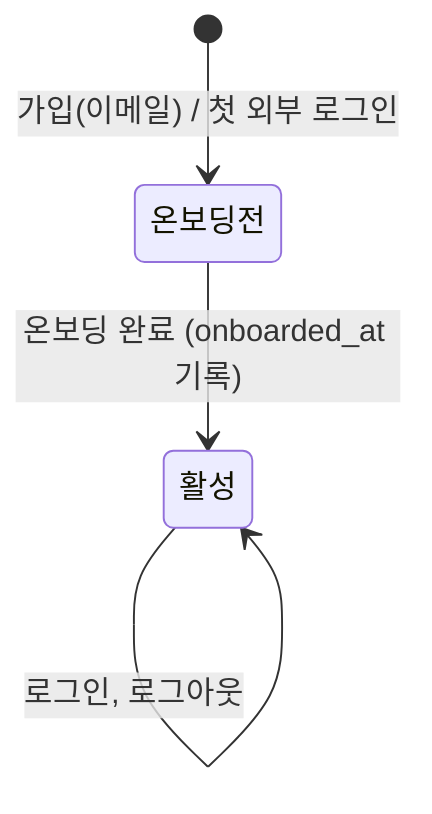
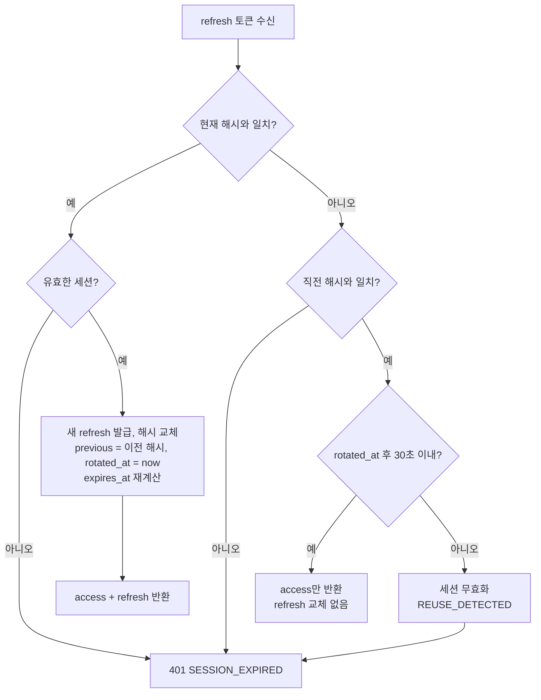

# Data Model: 인증과 회원 (002-auth)

모든 테이블은 `member` 모듈이 소유한다. 다른 모듈은 이 테이블을 직접 조회하지 않고 `MemberApi` 파사드를 거친다. 스키마는 Flyway `V2__member_auth.sql` 하나로 만든다.

## member (회원)

| 컬럼 | 타입 | 제약 | 설명 |
|---|---|---|---|
| id | bigint | PK, identity | |
| auth_method | varchar(10) | NOT NULL, `EMAIL`/`KAKAO`/`GOOGLE` | 가입 방법 |
| email | varchar(254) | NULL | 정규화(앞뒤 공백 제거, 소문자). 카카오는 없을 수 있다 |
| password_hash | varchar(100) | NULL | `{bcrypt}...`. 이메일 가입만 값이 있다 |
| nickname | varchar(10) | NULL | 입력한 그대로. 온보딩 전에는 NULL |
| nickname_key | varchar(10) | NULL, UNIQUE | `lower(nickname)`. 대소문자를 무시한 중복 판단용 |
| job_role | varchar(20) | NULL | 아래 목록 |
| career_year | varchar(20) | NULL | 아래 목록 |
| onboarded_at | timestamptz | NULL | NULL이면 온보딩 전 |
| created_at, updated_at | timestamptz | NOT NULL | `BaseTimeEntity` |

- 부분 유일 인덱스: `UNIQUE (email) WHERE auth_method = 'EMAIL'`. 이메일 가입끼리만 이메일이 겹치지 않으면 된다. 외부 계정 이메일은 참고 값이다.
- 체크 제약: `auth_method = 'EMAIL'`이면 `email`과 `password_hash`가 NOT NULL이다.
- 체크 제약: `onboarded_at`이 NOT NULL이면 `nickname`, `nickname_key`, `job_role`, `career_year`도 NOT NULL이다.

**직군(`job_role`)**: `PLANNING`(기획), `DESIGN`(디자인), `DEVELOPMENT`(개발), `MARKETING`(마케팅), `SALES`(영업), `HR`(인사), `GENERAL_AFFAIRS`(총무), `PRODUCTION`(생산), `ACCOUNTING`(회계), `OTHER`(기타)

**경력(`career_year`)**: `NEWCOMER`(신입), `YEAR_1`~`YEAR_6`(1~6년차), `YEAR_7_PLUS`(7년차 이상)

**검증 규칙**
- 이메일: RFC 5322 간이 형식, 254자 이하
- 비밀번호(원문, 저장 전): 8~20자, 영문 1자 이상과 숫자 1자 이상 포함
- 닉네임: 앞뒤 공백 제거 후 `^[가-힣A-Za-z0-9]{1,10}$`

**상태 전이**

온보딩은 한 번만 할 수 있다. 이미 활성인 회원이 온보딩 API를 다시 부르면 `409 ALREADY_ONBOARDED`를 돌려준다(프로필 수정은 범위 밖).

## oauth_identity (외부 계정 연결)

| 컬럼 | 타입 | 제약 | 설명 |
|---|---|---|---|
| id | bigint | PK, identity | |
| member_id | bigint | NOT NULL, FK → member.id | |
| provider | varchar(10) | NOT NULL, `KAKAO`/`GOOGLE` | |
| provider_user_id | varchar(255) | NOT NULL | 구글 `sub`, 카카오 `id` |
| email | varchar(254) | NULL | 제공자가 준 이메일(참고용) |
| created_at | timestamptz | NOT NULL | |

- `UNIQUE (provider, provider_user_id)`: 한 외부 계정은 한 회원에게만 연결된다.
- `UNIQUE (member_id, provider)`: 한 회원은 제공자마다 계정을 하나만 연결한다.

## auth_session (세션)

| 컬럼 | 타입 | 제약 | 설명 |
|---|---|---|---|
| id | uuid | PK | JWT `sid` 클레임 |
| member_id | bigint | NOT NULL, FK → member.id, INDEX | |
| refresh_token_hash | char(64) | NOT NULL, UNIQUE | 현재 refresh 토큰의 SHA-256(hex) |
| previous_refresh_token_hash | char(64) | NULL, UNIQUE | 직전 토큰. 교체 뒤 30초 유예용 |
| rotated_at | timestamptz | NULL | 마지막 교체 시각 |
| created_at | timestamptz | NOT NULL | 로그인 시각 |
| expires_at | timestamptz | NOT NULL | `min(마지막 갱신 + 14일, absolute_expires_at)` |
| absolute_expires_at | timestamptz | NOT NULL | `created_at + 30일` |
| revoked_at | timestamptz | NULL | 로그아웃, 재사용 감지 시각 |
| revoke_reason | varchar(20) | NULL | `LOGOUT`/`REUSE_DETECTED` |

**세션이 유효한 조건**: `revoked_at IS NULL AND now() < expires_at`

**refresh 처리**

`SELECT ... FOR UPDATE`로 세션 행을 잠그고 처리해 동시 교체를 직렬화한다.

## login_attempt (로그인 실패 기록)

| 컬럼 | 타입 | 제약 | 설명 |
|---|---|---|---|
| scope_key | varchar(300) | PK | `ip:{ip}\|email:{email}` 또는 `email:{email}` |
| window_started_at | timestamptz | NOT NULL | 현재 창 시작 |
| failure_count | int | NOT NULL | 창 안의 실패 수 |
| blocked_until | timestamptz | NULL | 차단 끝 시각 |

| 키 종류 | 창 | 한도 | 차단 |
|---|---|---|---|
| IP + 이메일 | 15분 | 5회 | 15분 |
| 이메일 | 1시간 | 20회 | 1시간 |

창이 지나면 다음 실패 때 `window_started_at`과 `failure_count`를 초기화한다. 로그인에 성공하면 IP+이메일 키를 지운다. 이메일 키는 지우지 않는다(여러 출처의 공격이 성공 한 번으로 초기화되지 않도록). 하루 지난 행은 스케줄러가 매일 지운다.

## JWT access 토큰 클레임

| 클레임 | 값 |
|---|---|
| `sub` | 회원 ID(문자열) |
| `sid` | 세션 ID |
| `onboarded` | boolean |
| `iat`, `exp` | 발급, 만료(15분) |
| `iss` | `ogu-api` |

## 공개 타입 (`member` 모듈 루트)

다른 모듈이 쓰는 타입이다.
- `MemberApi.getMember(memberId): MemberInfo`
- `MemberInfo(id, nickname, jobRole, careerYear)`
- `AuthenticatedMember(memberId, sessionId, onboarded)`: 컨트롤러가 인증된 사용자를 받는 타입
