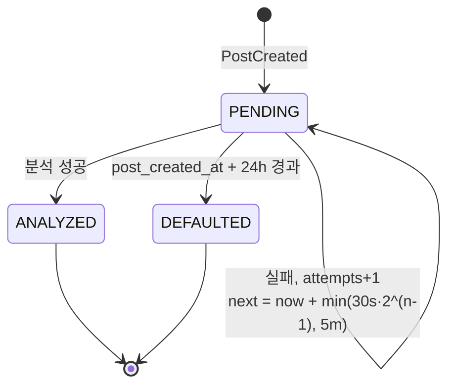

# Data Model: 핵심 루프 (003-core-loop)

Flyway `V3__core_loop.sql` 하나로 만든다. 테이블마다 소유 모듈이 있고, 다른 모듈은 그 테이블을 조회하지 않고 파사드를 거친다.

## post 모듈

### posts (고민 글)

| 컬럼 | 타입 | 제약 | 설명 |
|---|---|---|---|
| id | bigint | PK, identity | |
| author_id | bigint | NOT NULL, FK → member.id | |
| author_job_role | varchar(20) | NOT NULL | 작성 시점 스냅숏(research R7) |
| author_career_year | varchar(20) | NOT NULL | 작성 시점 스냅숏 |
| content | varchar(2000) | NOT NULL | 글자(grapheme) 1~500. 저장 전 앞뒤 공백 제거 |
| comment_tone | varchar(20) | NOT NULL | `VENT_WITH_ME`, `COMFORT_ME`, `WARM_ADVICE`, `MAKE_ME_LAUGH` |
| like_count | int | NOT NULL, DEFAULT 0, CHECK ≥ 0 | |
| comment_count | int | NOT NULL, DEFAULT 0, CHECK ≥ 0 | 살아 있는 댓글과 답글 수 |
| deleted_at | timestamptz | NULL | NULL이 아니면 삭제됨 |
| created_at, updated_at | timestamptz | NOT NULL | |

인덱스: `(id DESC) WHERE deleted_at IS NULL`, `(like_count DESC, id DESC) WHERE deleted_at IS NULL`, `(author_job_role, author_career_year) WHERE deleted_at IS NULL`, `(author_id, created_at)`(작성 제한, R9).

댓글 말투 표시 문구: 대신 욕해주기, 무조건 위로해주기, 따뜻한 조언해주기, 웃겨주기.

### comments (댓글과 답글)

| 컬럼 | 타입 | 제약 | 설명 |
|---|---|---|---|
| id | bigint | PK, identity | |
| post_id | bigint | NOT NULL, FK → posts.id | |
| author_id | bigint | NOT NULL, FK → member.id | |
| parent_id | bigint | NULL, FK → comments.id | 답글이면 원 댓글 |
| content | varchar(1200) | NOT NULL | 글자 1~300 |
| like_count | int | NOT NULL, DEFAULT 0, CHECK ≥ 0 | |
| deleted_at | timestamptz | NULL | |
| created_at, updated_at | timestamptz | NOT NULL | |

- 답글의 부모는 원 댓글이어야 한다(부모의 `parent_id`가 NULL). 애플리케이션에서 검사하고, 어기면 `400 INVALID_PARENT_COMMENT`다.
- 원 댓글을 지우면 같은 트랜잭션에서 그 답글들도 `deleted_at`을 채우고, `posts.comment_count`를 지운 개수만큼 줄인다.
- 인덱스: `(post_id, parent_id, id)`.

### post_likes, comment_likes (공감)

| 테이블 | 컬럼 | 제약 |
|---|---|---|
| post_likes | post_id, member_id, created_at | PK (post_id, member_id) |
| comment_likes | comment_id, member_id, created_at | PK (comment_id, member_id) |

- 공감 취소는 행을 지운다. 같은 회원이 다시 공감하면 행이 다시 생기지만, HP는 `monster_hp_log`의 유일 키 때문에 다시 줄지 않는다.
- 작성자의 자기 글 공감은 애플리케이션에서 `403 CANNOT_LIKE_OWN_POST`로 거절한다.
- 동시에 두 번 공감하면 PK 충돌을 `409 ALREADY_LIKED`로 바꾼다.

## emotion 모듈

### emotion_analysis

| 컬럼 | 타입 | 제약 | 설명 |
|---|---|---|---|
| post_id | bigint | PK | 글당 하나 |
| status | varchar(10) | NOT NULL | `PENDING`, `ANALYZED`, `DEFAULTED` |
| emotion | varchar(20) | NULL | `ANXIETY`, `LETHARGY`, `LONELINESS`, `SELF_DEPRECATION`, `IRRITATION`. PENDING이면 NULL |
| intensity | varchar(10) | NULL | `LOW`, `MEDIUM`, `HIGH` |
| reason | varchar(200) | NULL | 모델이 준 분류 근거(로그용, 화면에 보이지 않음) |
| attempts | int | NOT NULL, DEFAULT 0 | |
| next_attempt_at | timestamptz | NOT NULL | |
| last_error | varchar(200) | NULL | 실패 분류(타임아웃, 파싱 실패, 서킷 열림). 원문 응답은 저장하지 않는다 |
| post_created_at | timestamptz | NOT NULL | 24시간 기한 계산용 |
| completed_at | timestamptz | NULL | |

- 인덱스: `(next_attempt_at) WHERE status = 'PENDING'`.
- 체크 제약: `status <> 'PENDING'`이면 `emotion`과 `intensity`가 NOT NULL이다.

**상태 전이**

`ANALYZED`나 `DEFAULTED`가 되면 같은 트랜잭션에서 `EmotionAnalyzed(postId, emotion, intensity, defaulted)`를 발행한다. 기본값은 `LETHARGY`, `LOW`다.

**강도와 최대 HP**: `LOW` → 10, `MEDIUM` → 20, `HIGH` → 30.

## monster 모듈

### monsters

| 컬럼 | 타입 | 제약 | 설명 |
|---|---|---|---|
| id | bigint | PK, identity | |
| post_id | bigint | NOT NULL, UNIQUE | 글당 하나 |
| emotion | varchar(20) | NOT NULL | |
| max_hp | int | NOT NULL, CHECK IN (10, 20, 30) | |
| hp | int | NOT NULL, CHECK 0 ≤ hp ≤ max_hp | |
| status | varchar(10) | NOT NULL | `ALIVE`, `DEFEATED` |
| defeated_at | timestamptz | NULL | |
| created_at | timestamptz | NOT NULL | |

체크 제약: `(status = 'DEFEATED') = (hp = 0)`.

### monster_hp_log

| 컬럼 | 타입 | 제약 | 설명 |
|---|---|---|---|
| id | bigint | PK, identity | |
| monster_id | bigint | NOT NULL, FK → monsters.id | |
| member_id | bigint | NOT NULL | 행동한 회원 |
| action | varchar(15) | NOT NULL | `POST_LIKE`, `COMMENT`, `COMMENT_LIKE` |
| target_id | bigint | NOT NULL | POST_LIKE와 COMMENT는 post_id, COMMENT_LIKE는 comment_id |
| hp_delta | int | NOT NULL | 1 또는 3 |
| hp_before, hp_after | int | NOT NULL | |
| retroactive | boolean | NOT NULL, DEFAULT false | 몬스터 생성 때 소급 반영됐으면 true |
| created_at | timestamptz | NOT NULL | |

유일 제약: `UNIQUE (monster_id, member_id, action, target_id)`. 이 제약이 "공감은 한 번", "댓글 감소는 회원당 글 하나에 한 번", "취소 후 재공감은 다시 줄지 않음"을 모두 보장한다(research R5).

**감소량**: `POST_LIKE` 1, `COMMENT` 3, `COMMENT_LIKE` 1.

**반영 규칙**
1. 행동한 회원이 글 작성자면 반영하지 않는다(FR-007a).
2. 몬스터가 없으면 반영하지 않는다. 몬스터를 만들 때 소급 반영된다(FR-006a).
3. 글 단위 advisory lock 안에서 기록 삽입(`ON CONFLICT DO NOTHING`)에 성공했을 때만 HP를 줄인다.
4. HP는 0에서 멈춘다. 처치된 몬스터에 대한 공격은 `hp_delta`를 그대로, `hp_before = hp_after = 0`으로 기록한다(통계에서 "처치 뒤 응원"을 셀 수 있게).

## 이벤트 (모듈 루트 공개 타입)

| 이벤트 | 발행 | 구독 | 전달 방식 |
|---|---|---|---|
| `PostCreated(postId, authorId, content, createdAt)` | post | emotion | 커밋 후 비동기 |
| `PostLiked(postId, memberId)` | post | monster | 같은 트랜잭션 동기 |
| `CommentCreated(postId, commentId, memberId)` | post | monster | 같은 트랜잭션 동기 |
| `CommentLiked(postId, commentId, memberId)` | post | monster | 같은 트랜잭션 동기 |
| `EmotionAnalyzed(postId, emotion, intensity, defaulted)` | emotion | monster | 커밋 후 비동기 |
| `MonsterDefeated(postId, monsterId)` | monster | (M3 알림) | 커밋 후 비동기 |

## 공개 파사드

- `PostApi.attacksSoFar(postId): List<Attack(memberId, action, targetId)>`: 작성자 제외, 살아 있는 공감, 회원별 첫 살아 있는 댓글, 살아 있는 댓글 공감
- `PostApi.page(query): PostPage`, `PostApi.find(postId): PostSummary?`
- `EmotionApi.findByPostIds(ids): Map<Long, EmotionView>`
- `MonsterApi.findByPostIds(ids): Map<Long, MonsterView>`
- `MemberApi.getMembers(ids): Map<Long, MemberInfo>` (M1 파사드에 일괄 조회 추가)
