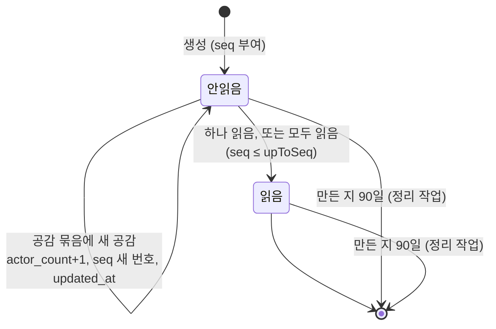
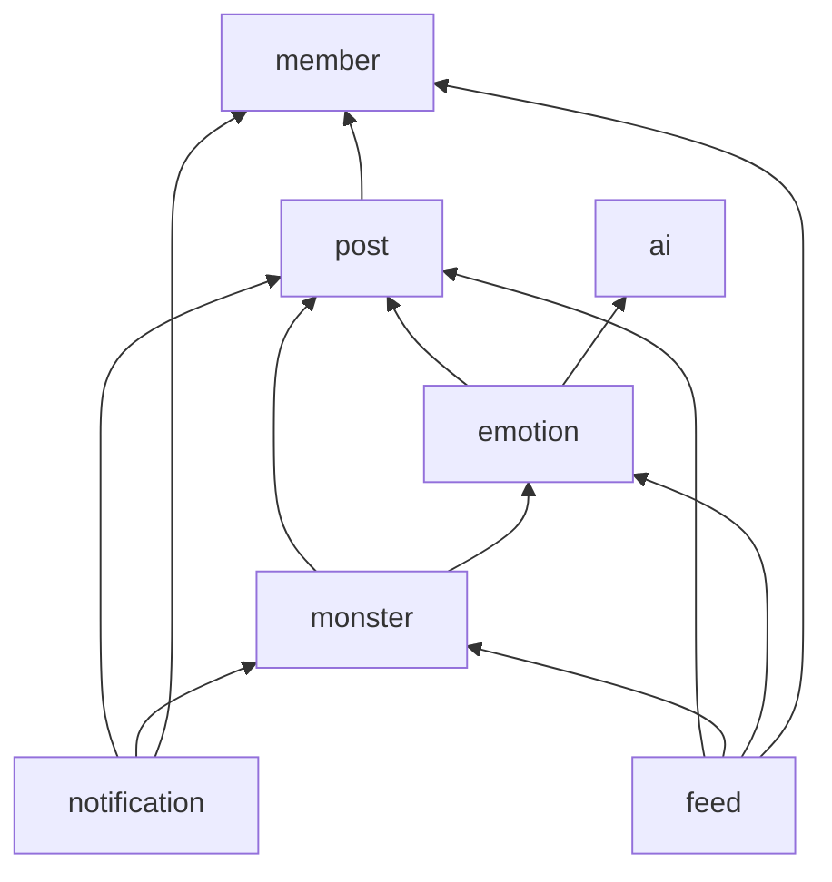

# Data Model: 알림과 마이페이지 (004-notification-mypage)

Flyway `V4__notification_mypage.sql` 하나로 만든다. 새 테이블은 4개이고, 기존 테이블에는 마이페이지 조회용 인덱스만 더한다. 테이블마다 소유 모듈이 있고, 다른 모듈은 파사드를 거친다. 003과 같이 제약에는 모두 이름을 붙이고, 모듈 경계를 넘는 참조에는 FK를 두지 않는다.

## notification 모듈

### notification (알림)

| 컬럼 | 타입 | 제약 | 설명 |
|---|---|---|---|
| id | bigint | PK, identity | |
| receiver_id | bigint | NOT NULL | 받는 회원 |
| type | varchar(30) | NOT NULL | 아래 종류 표 |
| post_id | bigint | NOT NULL | 관련 글. 글이 지워져도 남는다 |
| comment_id | bigint | NULL | 댓글과 답글 알림일 때 |
| monster_id | bigint | NULL | 몬스터 알림일 때 |
| latest_actor_id | bigint | NULL | 가장 최근 행동한 회원. 몬스터 알림은 NULL |
| actor_count | int | NOT NULL, DEFAULT 1, CHECK ≥ 1 | 공감 묶음의 인원 수. 다른 종류는 1 |
| dedup_key | varchar(40) | NULL | 멱등 키(research R6). 공감 묶음은 NULL |
| seq | bigint | NOT NULL | 회원별 전달 순서 번호. SSE `id`(research R4) |
| read_at | timestamptz | NULL | NULL이면 안 읽음 |
| created_at | timestamptz | NOT NULL | 보관 기간(90일) 기준 |
| updated_at | timestamptz | NOT NULL | 마지막 갱신. 묶음에 공감이 더해질 때 바뀐다 |

제약과 인덱스:
- `notification_receiver_seq_key UNIQUE (receiver_id, seq)`: 목록 키셋(`seq DESC`)과 재전송(`seq >`)을 같이 맡는다.
- `notification_receiver_dedup_key UNIQUE (receiver_id, dedup_key)`: NULL은 서로 겹치지 않으므로 공감 묶음에는 걸리지 않는다.
- `notification_unread_like_group_key UNIQUE (receiver_id, post_id) WHERE type = 'POST_LIKE' AND read_at IS NULL`: 안 읽은 공감 묶음은 글마다 하나(research R7).
- `notification_unread_idx (receiver_id) WHERE read_at IS NULL`: 안 읽은 수.
- `notification_created_at_idx (created_at)`: 정리 작업.
- 체크: `type`은 아래 7종, `type = 'POST_LIKE' OR actor_count = 1`, `type <> 'POST_LIKE' OR dedup_key IS NULL`.

**종류**

| type | 받는 사람 | 행동한 회원 | dedup_key | 화면 문구 |
|---|---|---|---|---|
| `POST_COMMENT` | 글쓴이 | 댓글 작성자 | `COMMENT:{commentId}` | 닉네임 님이 내 글에 댓글을 남겼어요 |
| `POST_REPLY` | 글쓴이 | 답글 작성자 | `COMMENT:{commentId}` | 닉네임 님이 내 글에 답글을 남겼어요 |
| `COMMENT_REPLY` | 원 댓글 주인 | 답글 작성자 | `COMMENT:{commentId}` | 닉네임 님이 내 댓글에 답글을 남겼어요 |
| `POST_LIKE` | 글쓴이 | 가장 최근 공감한 회원 | NULL | 닉네임 님 외 N명이 공감했어요 (N = actor_count − 1, 0이면 "외 N명" 생략) |
| `MONSTER_SPAWNED` | 글쓴이 | 없음 | `SPAWNED:{monsterId}` | 몬스터가 나타났어요 |
| `MONSTER_DEFEATED` | 글쓴이 | 없음 | `DEFEATED:{monsterId}` | 내 몬스터가 처치됐어요 |
| `MONSTER_DEFEATED_TOGETHER` | HP를 줄인 회원 | 없음 | `DEFEATED:{monsterId}` | 함께 공격한 몬스터가 처치됐어요 |

### notification_sequence (알림 전달 기록)

| 컬럼 | 타입 | 제약 | 설명 |
|---|---|---|---|
| member_id | bigint | PK | |
| last_seq | bigint | NOT NULL, CHECK ≥ 0 | 이 회원에게 마지막으로 준 번호 |

번호 받기: `INSERT INTO notification_sequence (member_id, last_seq) VALUES (:m, 1) ON CONFLICT (member_id) DO UPDATE SET last_seq = notification_sequence.last_seq + 1 RETURNING last_seq`. 행 잠금이 커밋까지 남아 같은 회원의 알림 쓰기를 줄 세운다(research R4). 한 트랜잭션이 여러 회원의 번호를 받으면 회원 ID 오름차순으로 받는다.

### like_notification_participant (공감 알림 묶음 참여자)

| 컬럼 | 타입 | 제약 | 설명 |
|---|---|---|---|
| post_id | bigint | PK(1) | |
| liker_id | bigint | PK(2) | 공감한 회원 |
| notification_id | bigint | NOT NULL, FK → notification.id ON DELETE CASCADE | 이 공감이 들어간 묶음 |
| created_at | timestamptz | NOT NULL | |

- 기본 키 `(post_id, liker_id)`가 "같은 회원의 같은 글 공감은 한 번만 알린다"를 보장한다. 받는 사람은 글쓴이 한 명이라 키에 넣지 않는다.
- 인덱스: `(notification_id)`(CASCADE 삭제용).

## member 모듈

### sse_ticket (연결 표)

| 컬럼 | 타입 | 제약 | 설명 |
|---|---|---|---|
| token_hash | char(64) | PK | 티켓 원문의 SHA-256 16진수. 원문은 저장하지 않는다 |
| member_id | bigint | NOT NULL, FK → member.id | |
| session_id | uuid | NOT NULL | 발급한 세션. 소비할 때 세션이 아직 유효해야 한다 |
| created_at | timestamptz | NOT NULL | |
| expires_at | timestamptz | NOT NULL | created_at + 30초 |
| used_at | timestamptz | NULL | NULL이면 아직 안 씀 |

- 체크: `expires_at > created_at`.
- 인덱스: `(expires_at)`(정리 작업).
- 소비는 조건부 `UPDATE ... WHERE token_hash = :h AND used_at IS NULL AND expires_at > now() RETURNING member_id, session_id` 한 문장이다(research R3).

### member (기존)

스키마는 바꾸지 않는다. 프로필 수정은 `nickname`, `nickname_key`, `job_role`, `career_year`, `updated_at`을 고친다. `nickname_key`의 유일 제약이 동시 저장을 막는다(research R13).

## post 모듈 (인덱스만 추가)

| 인덱스 | 쓰는 곳 |
|---|---|
| `posts_author_live_idx ON posts (author_id, id DESC) WHERE deleted_at IS NULL` | 내가 쓴 글 키셋, 통계용 글 목록 |
| `comments_author_live_idx ON comments (author_id, id DESC) WHERE deleted_at IS NULL` | 내 댓글 키셋 |
| `post_likes_member_created_idx ON post_likes (member_id, created_at DESC, post_id DESC)` | 공감한 글 키셋 |

## monster 모듈 (인덱스만 추가)

| 인덱스 | 쓰는 곳 |
|---|---|
| `monster_hp_log_member_monster_idx ON monster_hp_log (member_id, monster_id)` | 함께 물리친 몬스터(research R12) |

처치 알림의 `damagerIds(monsterId)`는 기존 유일 키 `(monster_id, member_id, action, target_id)`의 앞부분으로 찾는다.

## 상태 규칙

### 알림 읽음

- 읽은 알림은 다시 안 읽음이 되지 않는다. 읽은 공감 묶음에 새 공감이 오면 새 묶음이 생긴다(명확화 2).
- 공감 묶음 말고는 만든 뒤 바뀌지 않는다(읽음 제외).
- 목록, 안 읽은 수, 재전송, 읽음 처리는 `created_at >= now() − 90일`만 본다. 정리 작업이 늦어도 보관 기간이 지켜진다.

### 알림 생성 규칙

1. 글이 지워졌으면(`PostApi.find(postId) == null`) 만들지 않는다.
2. 행동한 회원과 받는 사람이 같으면 만들지 않는다.
3. 받는 사람의 카운터 행을 잠그고 번호를 받은 뒤 쓴다. 여러 명이면 회원 ID 오름차순이다.
4. 멱등 키나 참여자 키에 걸리면 아무것도 바꾸지 않고, 신호도 보내지 않는다.
5. 커밋 뒤 훅에서 쓴 회원마다 Redis 채널 `ogu:notification`에 `{memberId}:n:{seq}`를 발행한다. 내용은 싣지 않고, 발행이 실패해도 알림은 남는다(research R5).

### 연결 표

`발급(used_at NULL)` → `사용(used_at 기록)` 한 번만. 만료 시각이 지나면 사용할 수 없다. 하루 지난 행은 정리 작업이 지운다.

### 감정 통계 계산 (저장하지 않음)

| 값 | 정의 |
|---|---|
| 전체 몬스터 | 내 살아 있는 글 가운데 몬스터가 있는 글 수 |
| 처치된 몬스터 | 그 가운데 `status = DEFEATED` |
| 감정별 수와 비율 | 감정 5종 고정 순서. 비율은 정수 %, 합이 100이 아니면 가장 큰 항목에서 맞춘다. 몬스터가 없으면 모두 0 |
| 가장 많이 나타난 몬스터 | 수가 가장 큰 감정. 같으면 그 감정들 가운데 가장 최근 몬스터의 감정. 없으면 null |
| 주별 추이 | 글 작성 시각을 한국 시간 월요일 0시 기준 주로 묶은 8주(이번 주 포함, 오래된 주부터). 빈 주는 0 |
| 함께 물리친 몬스터 | 내가 HP를 줄인(`hp_after < hp_before`) 처치된 몬스터 가운데 글이 살아 있는 것의 수 |

## 이벤트 (모듈 루트 공개 타입)

| 이벤트 | 발행 | 구독 | 전달 방식 | 이번 변경 |
|---|---|---|---|---|
| `PostLiked(postId, memberId)` | post | monster, **notification** | monster는 같은 트랜잭션 동기, notification은 커밋 후 비동기 | 구독 추가 |
| `CommentCreated(postId, commentId, memberId)` | post | monster, **notification** | 위와 같음 | 구독 추가 |
| `CommentLiked(postId, commentId, memberId)` | post | monster | 같은 트랜잭션 동기 | 없음(댓글 공감은 알리지 않는다) |
| `MonsterSpawned(postId, monsterId, defaulted)` | monster | notification | 커밋 후 비동기 | **새 이벤트**. `MonsterFactory`가 몬스터 저장 직후 발행 |
| `MonsterDefeated(postId, monsterId)` | monster | notification | 커밋 후 비동기 | 구독 추가 |

`notification`의 리스너는 모두 `@ApplicationModuleListener`다. 실패하면 Event Publication Registry에 남고 `EventPublicationResubmitter`가 다시 보낸다. 같은 이벤트가 여러 번 와도 위의 생성 규칙 4가 결과를 하나로 만든다.

## 공개 파사드 (추가분)

**PostApi**
- `findComment(commentId): CommentSummary?`: 살아 있는 댓글의 `postId`, `authorId`, `parentId`, `parentAuthorId`. 지웠으면 null
- `previews(postIds): Map<Long, PostPreview>`: 지운 글도 포함해 `postId`, `contentPreview`(앞 50글자), `deleted`. 알림 목록이 쓴다
- `pageByAuthor(authorId, cursor, size): PostPage`: 내가 쓴 글(`id DESC`)
- `pageLikedBy(memberId, cursor, size): PostPage`: 공감한 글(공감 시각 `DESC`)
- `pageCommentsByAuthor(authorId, cursor, size): MyCommentPage`: 내 댓글(`id DESC`), 항목마다 `commentId`, `postId`, `content`, `isReply`, `createdAt`, 글 본문 앞부분
- `liveRefsByAuthor(authorId): List<PostRef(postId, createdAt)>`: 통계용
- `liveIds(postIds): Set<Long>`: 그 가운데 살아 있는 글

**MonsterApi**
- `damagerIds(monsterId): Set<Long>`: HP를 실제로 줄인 회원(research R9)
- `statRows(postIds): List<MonsterStatRow(postId, emotion, status, createdAt)>`
- `defeatedPostIdsDamagedBy(memberId): Set<Long>`

**MemberApi**
- `issueStreamTicket(memberId, sessionId): StreamTicket(ticket, expiresAt)`
- `consumeStreamTicket(ticket): Long?`: 성공하면 회원 ID, 쓴 티켓이거나 만료됐거나 세션이 끝났으면 null

`notification`과 `feed`는 여전히 파사드를 노출하지 않는다(HTTP API만).

## 모듈 의존 그래프 (M3 이후)

- overview 5.1 그래프와 비교하면 `notification → member`가 새로 생긴다(행동한 회원 닉네임, 연결 표). `member`는 아무것도 의존하지 않으므로 순환이 없다.
- `notification`은 `emotion`을 모른다. 몬스터 생성은 `monster`의 `MonsterSpawned`로 받는다.
- overview 그래프의 `notification → safety`, `notification → report`는 M4와 M7에서 들어온다.
- `notification/package-info.java`: `allowedDependencies = {"shared", "post", "monster", "member"}`. `ModularityTests`가 검증한다.
