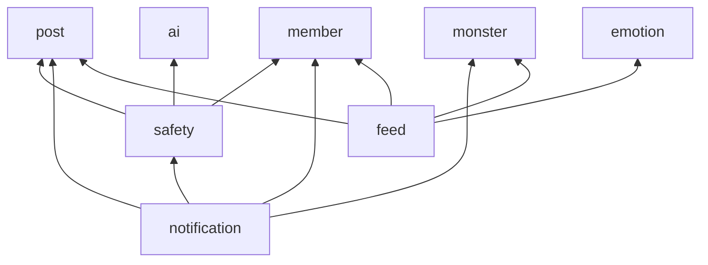

# Data Model: 위험 감지와 안전장치 (005-safety)

Flyway `V5__safety.sql` 하나로 만든다. 제약은 모두 이름을 붙이고, 모듈 경계를 넘는 참조에는 FK를 두지 않는다(M2, M3와 같다). 결정 번호는 [research.md](research.md)를 가리킨다.

## 기존 테이블의 변경

### posts, comments (post 모듈, R5, R7)

| 열 | 형 | 설명 |
|---|---|---|
| `hidden_at` | `TIMESTAMPTZ` NULL | 다른 회원에게 보이지 않게 된 시각. NULL이면 보인다 |
| `hidden_reason` | `VARCHAR(20)` NULL | `RISK`(위기 판정), `OPERATOR`(운영자 처리) |
| `risk_level` | `VARCHAR(10)` NOT NULL DEFAULT `'NONE'` | 가장 최근 판정의 단계. 작성자에게만 응답에 실린다 |
| `review_requested_at` | `TIMESTAMPTZ` NULL | 작성자가 재검토를 요청한 시각. 작성자에게만 `safety.reviewRequested`로 실린다 |

- 제약: `hidden_at`과 `hidden_reason`은 함께 NULL이거나 함께 값이 있다. `hidden_reason IN ('RISK', 'OPERATOR')`, `risk_level IN ('NONE', 'CONCERN', 'CRISIS')`.
- 보이는 글의 조건은 `deleted_at IS NULL AND hidden_at IS NULL`이다.
- 인덱스: 피드용 부분 인덱스 셋을 새 조건으로 다시 만든다.
  - `posts_feed_latest_idx (id DESC) WHERE deleted_at IS NULL AND hidden_at IS NULL`
  - `posts_feed_popular_idx (like_count DESC, id DESC) WHERE deleted_at IS NULL AND hidden_at IS NULL`
  - `posts_feed_author_profile_idx (author_job_role, author_career_year) WHERE deleted_at IS NULL AND hidden_at IS NULL`
- `posts_author_live_idx`, `comments_author_live_idx`, `post_likes_member_created_idx`는 그대로다(작성자는 숨긴 것도 본다. 공감한 글은 조인한 `posts`에서 거른다).

### member (member 모듈, R10)

| 열 | 형 | 설명 |
|---|---|---|
| `role` | `VARCHAR(10)` NOT NULL DEFAULT `'MEMBER'` | `MEMBER`, `OPERATOR` |

### notification (notification 모듈, R8)

- `notification_type_check`에 `SUPPORT_NOTICE`, `CONTENT_RESTORED`, `REVIEW_KEPT`를 더한다.
- `post_id`는 그대로 NOT NULL이다(세 종류 모두 글이 있다. 댓글이 대상이면 그 댓글의 글이다). `comment_id`는 대상이 댓글일 때 채운다.
- `dedup_key` 길이를 40에서 60으로 늘린다(`RESTORED:COMMENT:{id}:{actionId}`).

## 새 테이블 (safety 모듈)

### risk_assessment (R3, R12)

대상의 위험 판정 한 번. 대상이 고쳐지면 새 행이 생기고 가장 최근 행이 지금 상태다.

| 열 | 형 | 설명 |
|---|---|---|
| `id` | `BIGINT` IDENTITY | |
| `target_type` | `VARCHAR(10)` | `POST`, `COMMENT` |
| `target_id` | `BIGINT` | |
| `post_id` | `BIGINT` | 대상이 댓글이면 그 댓글의 글. 알림과 운영자 조회에 쓴다 |
| `author_id` | `BIGINT` | |
| `content_version` | `TIMESTAMPTZ` | 판정한 내용의 `updated_at`. 고친 뒤 늦게 온 분류 결과를 버리는 기준 |
| `keyword_level` | `VARCHAR(10)` | 키워드 규칙의 단계 |
| `ai_level` | `VARCHAR(10)` NULL | AI 분류의 단계. 아직이거나 실패면 NULL |
| `level` | `VARCHAR(10)` | 지금까지의 최종 단계. `max(keyword_level, ai_level)` |
| `status` | `VARCHAR(10)` | `PENDING`(AI 대기), `DONE`(AI 반영), `FALLBACK`(AI 포기, 키워드만), `SUPERSEDED`(고쳐져 새 판정이 생김) |
| `attempts` | `INT` DEFAULT 0 | AI 시도 횟수 |
| `next_attempt_at` | `TIMESTAMPTZ` | 다음 시도 시각 |
| `last_error` | `VARCHAR(100)` NULL | 실패 분류(`TIMEOUT`, `HTTP_5XX` 등). 응답 원문은 넣지 않는다 |
| `reviewed_at` | `TIMESTAMPTZ` NULL | 운영자가 확인한 시각 |
| `created_at`, `completed_at` | `TIMESTAMPTZ` | |

- 인덱스: `(target_type, target_id, id DESC)`(대상의 최근 판정), `(next_attempt_at) WHERE status = 'PENDING'`(재시도), `(level, id DESC) WHERE level <> 'NONE'`(운영자 조회), `(created_at)`(1년 정리).
- 걸린 표현과 본문 사본은 저장하지 않는다(R13).

**상태 전이**:

```text
(저장/수정) → PENDING ──AI 성공──→ DONE
                 │
                 ├─AI 실패, 24시간 안─→ PENDING (next_attempt_at 뒤로)
                 ├─24시간 지남──────→ FALLBACK
                 └─대상이 고쳐짐────→ SUPERSEDED (새 행이 PENDING으로 생김)
```

### report (R9)

| 열 | 형 | 설명 |
|---|---|---|
| `id` | `BIGINT` IDENTITY | |
| `reporter_id` | `BIGINT` | |
| `target_type`, `target_id`, `post_id` | | 위와 같다 |
| `reason` | `VARCHAR(10)` | `DANGEROUS`, `ABUSIVE`, `SPAM`, `OTHER` |
| `detail` | `VARCHAR(800)` NULL | 200글자(grapheme)까지. `OTHER`일 때만 |
| `status` | `VARCHAR(10)` | `PENDING`, `RESOLVED`, `REJECTED`, `CLOSED`(대상이 지워짐) |
| `created_at`, `closed_at` | `TIMESTAMPTZ` | |

- 유일: `report_reporter_target_key (reporter_id, target_type, target_id)` → `409 ALREADY_REPORTED`.
- 인덱스: `(status, id DESC)`, `(target_type, target_id) WHERE status = 'PENDING'`(대상별 열린 신고 수와 한꺼번에 닫기), `(reporter_id, created_at)`(한 시간 20건), `(created_at)`.

### review_request (R11)

| 열 | 형 | 설명 |
|---|---|---|
| `id` | `BIGINT` IDENTITY | |
| `target_type`, `target_id`, `post_id` | | |
| `requester_id` | `BIGINT` | 대상의 작성자 |
| `status` | `VARCHAR(10)` | `PENDING`, `KEPT`, `RESTORED` |
| `created_at`, `closed_at` | `TIMESTAMPTZ` | |

- 유일: `review_request_target_key (target_type, target_id)` → `409 REVIEW_ALREADY_REQUESTED`.

### moderation_action (R10)

운영자가 한 일의 기록. 고치거나 지우지 않는다(1년 정리만).

| 열 | 형 | 설명 |
|---|---|---|
| `id` | `BIGINT` IDENTITY | |
| `operator_id` | `BIGINT` | |
| `action` | `VARCHAR(20)` | `HIDE`, `UNHIDE`, `RESOLVE_REPORT`, `REJECT_REPORT`, `KEEP_HIDDEN`, `ADD_TERM`, `REMOVE_TERM` |
| `target_type` | `VARCHAR(10)` NULL | `POST`, `COMMENT`, `TERM` |
| `target_id` | `BIGINT` NULL | |
| `note` | `VARCHAR(200)` NULL | 운영자가 남긴 메모. 본문을 옮겨 적지 않는다 |
| `created_at` | `TIMESTAMPTZ` | |

### safety_term (R4)

| 열 | 형 | 설명 |
|---|---|---|
| `id` | `BIGINT` IDENTITY | |
| `kind` | `VARCHAR(10)` | `CRISIS`, `CONCERN`, `PROFANITY`, `ALLOW` |
| `term` | `VARCHAR(40)` | 정규화한 형태로 저장한다 |
| `created_at`, `updated_at` | `TIMESTAMPTZ` | 지우면 행을 없앤다. 목록이 바뀐 것은 `count(*)`와 `max(updated_at)`으로 알아챈다 |

- 유일: `(kind, term)`.
- 시드: 위기 목록은 원본의 6개(죽고싶, 자살, 자해, 스스로목숨, 삶을끝, 죽어버리고싶)에서 시작해 plan의 작업에서 보탠다. 우려, 욕설, 허용 목록의 초깃값도 `V5`에 넣는다.

### support_resource (R7)

| 열 | 형 | 설명 |
|---|---|---|
| `id` | `BIGINT` IDENTITY | |
| `name` | `VARCHAR(40)` | 예: 자살예방상담전화 |
| `phone` | `VARCHAR(20)` | 예: 109 |
| `hours` | `VARCHAR(40)` | 예: 24시간 |
| `description` | `VARCHAR(100)` | |
| `display_order` | `INT` | |
| `active` | `BOOLEAN` DEFAULT true | |

- 시드: 자살예방상담전화 109, 정신건강위기상담전화 1577-0199, 청소년상담전화 1388. 번호는 출시 전에 공식 안내로 확인한다(스펙 Assumptions).

### safety_backfill (R14)

| 열 | 형 | 설명 |
|---|---|---|
| `target_type` | `VARCHAR(10)` PK | `POST`, `COMMENT` |
| `last_id` | `BIGINT` | 여기까지 훑었다 |
| `finished_at` | `TIMESTAMPTZ` NULL | 값이 있으면 다시 돌지 않는다 |

## 이벤트

| 이벤트 | 내는 모듈 | 시점 | 받는 모듈 |
|---|---|---|---|
| `PostWritten(postId, authorId, edited)` | post | 저장, 수정과 같은 트랜잭션 | safety(동기: 키워드 판정과 숨김. 커밋 뒤: AI 분류) |
| `CommentWritten(postId, commentId, authorId, edited)` | post | 같다 | safety |
| `PostRemoved(postId)`, `CommentRemoved(commentId)` | post | 삭제와 같은 트랜잭션 | safety(열린 신고와 재검토 닫기) |
| `RiskDetected(targetType, targetId, postId, authorId, level)` | safety | 단계가 올라간 판정의 커밋 뒤 | notification(`SUPPORT_NOTICE`) |
| `ContentRestored(targetType, targetId, postId, authorId, actionId)` | safety | 숨김 해제 커밋 뒤 | notification(`CONTENT_RESTORED`) |
| `ReviewResolved(requestId, targetType, targetId, postId, requesterId, kept)` | safety | 재검토 닫기 커밋 뒤 | notification(`kept`이면 `REVIEW_KEPT`) |

이벤트에는 본문을 싣지 않는다(끝난 발행도 `event_publication`에 7일 남는다).

## 공개 파사드 (추가와 변경)

**PostApi** (변경)
- `find(postId)`, `findComment(commentId)`: 숨긴 것도 null로 돌려준다(보이는 것만).
- `previews(postIds, viewerId)`: 숨긴 글은 `deleted = true`. `viewerId`가 작성자면 미리보기를 그대로 준다.

**PostModerationApi** (새 파사드, post 모듈)
- `contentOf(targetType, targetId): ModerationTarget?`: 원문, 작성자, 글 ID, `updatedAt`, 숨김 여부. 지운 것은 null. safety만 쓴다.
- `markRisk(targetType, targetId, level)`: `risk_level` 열을 적는다.
- `markReviewRequested(targetType, targetId)`: `review_requested_at` 열을 적는다.
- `hide(targetType, targetId, reason): Boolean`: 이미 숨겨져 있으면 false.
- `unhide(targetType, targetId): Boolean`: 숨겨져 있지 않거나 지워졌으면 false.
- `scan(targetType, afterId, limit): List<ModerationTarget>`: 이미 있는 글 훑기(R14).

**MemberApi** (추가)
- `isOperator(memberId): Boolean`

**shared**
- `ContentMask.mask(text): String`: 욕설 가리기. 구현은 safety가 준다(R6).

**ai**
- `RiskClassifier.classify(text): RiskClassification`, `RiskClassificationFailed`

## 의존 그래프 (이번에 바뀌는 부분)



`post`, `feed`, `notification`은 `shared`의 `ContentMask`만 보고 `safety`의 구현을 주입받는다. 타입 의존은 `shared`를 향하므로 `post → safety`는 생기지 않는다.

## 오류 코드 (추가)

| 코드 | 상태 | 뜻 |
|---|---|---|
| `ALREADY_REPORTED` | 409 | 같은 대상을 이미 신고함 |
| `CANNOT_REPORT_OWN_CONTENT` | 403 | 자기 글이나 댓글 |
| `REPORT_RATE_LIMITED` | 429 | 한 시간 20건 초과(`Retry-After`) |
| `REVIEW_ALREADY_REQUESTED` | 409 | 이미 재검토를 요청한 대상 |

숨겼거나 지운 대상은 기존의 `POST_NOT_FOUND`, `COMMENT_NOT_FOUND`를 쓴다. 운영자가 아닌 회원의 운영자 경로 접근은 `NOT_FOUND`다.
