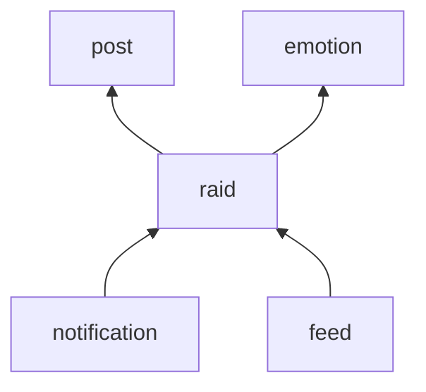

# Data Model: 보스 레이드 (006-raid)

Flyway `V6__raid.sql`로 만든다. 결정 근거는 [research.md](research.md)다.

## 새 테이블 (소유: `raid`)

### `raid_boss`

보스 하나. 살아 있는 것은 한 번에 하나다.

| 열 | 타입 | 설명 |
|---|---|---|
| `id` | BIGINT, PK | |
| `emotion` | VARCHAR(20) NOT NULL | `EmotionType`의 이름. 만들 때 정한다(R9) |
| `max_hp` | INT NOT NULL | 300~5,000(R9). 설정으로 범위를 바꿀 수 있어 CHECK는 `> 0`만 건다 |
| `hp` | INT NOT NULL | 마지막으로 옮겨 적은 남은 HP. 살아 있는 동안의 정확한 값은 Redis에 있다(R2, R3) |
| `participant_count` | INT NOT NULL DEFAULT 0 | 마지막으로 옮겨 적은 참여자 수. 끝난 뒤에는 최종 값이다 |
| `status` | VARCHAR(10) NOT NULL | `ALIVE`, `DEFEATED`, `RETREATED` |
| `spawned_at` | TIMESTAMPTZ NOT NULL | |
| `ended_at` | TIMESTAMPTZ | 처치되거나 물러난 때. 살아 있으면 NULL |

- CHECK: `hp BETWEEN 0 AND max_hp`, `(status = 'ALIVE') = (ended_at IS NULL)`, `status <> 'DEFEATED' OR hp = 0`.
- `CREATE UNIQUE INDEX raid_boss_alive_key ON raid_boss ((true)) WHERE status = 'ALIVE'`: 살아 있는 보스는 하나뿐이다(US5-AC6).
- `CREATE INDEX raid_boss_ended_at_idx ON raid_boss (ended_at DESC)`: 가장 최근에 끝난 보스.

**상태 규칙**

```text
(없음) ──나타남──▶ ALIVE ──HP 0──▶ DEFEATED
                    └──7일──▶ RETREATED
```

- `ALIVE → DEFEATED`와 `ALIVE → RETREATED`는 `WHERE status = 'ALIVE'` 조건부 UPDATE다. 한 번만 일어난다(R5).
- 끝난 보스는 다시 살아나지 않는다.
- `hp`는 줄어들기만 한다(`least`). 끝날 때 `DEFEATED`면 0, `RETREATED`면 그때의 값이다.

### `raid_contribution`

한 회원이 한 보스에게 준 피해의 합.

| 열 | 타입 | 설명 |
|---|---|---|
| `boss_id` | BIGINT NOT NULL | |
| `member_id` | BIGINT NOT NULL | |
| `damage` | INT NOT NULL | 받아들여진 공격 수. 늘어나기만 한다(`greatest`) |
| `first_attack_at` | TIMESTAMPTZ NOT NULL | 처음 옮겨 적은 때 |
| `updated_at` | TIMESTAMPTZ NOT NULL | |

- PK `(boss_id, member_id)`. CHECK `damage > 0`.
- `CREATE INDEX raid_contribution_member_idx ON raid_contribution (member_id, boss_id)`: 함께 물리친 보스 수(R12).
- FK는 `boss_id → raid_boss(id)`만 건다. `member_id`는 다른 모듈의 테이블이라 걸지 않는다(M2부터의 규칙).
- 불변식: 보스가 끝난 뒤 `sum(damage) = max_hp − hp`다. 살아 있는 동안에는 Redis가 같은 불변식을 지키고 Postgres는 최대 1초 뒤처진다.

## 바뀌는 테이블

### `notification` (소유: `notification`)

- `post_id`를 NULL 허용으로 바꾼다.
- `raid_boss_id BIGINT`를 더한다.
- `notification_type_check`에 `RAID_BOSS_DEFEATED`를 더한다.
- CHECK `notification_target_check`: `(type = 'RAID_BOSS_DEFEATED') = (post_id IS NULL)`이고 `(type = 'RAID_BOSS_DEFEATED') = (raid_boss_id IS NOT NULL)`.

| 종류 | 받는 이벤트 | 받는 사람 | 문구 | 멱등 키 |
|---|---|---|---|---|
| `RAID_BOSS_DEFEATED` | `RaidBossDefeated` | 그 보스를 한 번이라도 공격한 회원 | 함께 보스를 물리쳤어요 | `RAID:{bossId}` |

## Redis (소유: `raid`)

키는 모두 `raid:` 아래에 둔다. 보스 하나에 쓰는 메모리는 참여자 1만 명일 때 1MB 안쪽이다(64MB 상한).

| 키 | 종류 | 내용 | 만료 |
|---|---|---|---|
| `raid:boss` | hash | `id`, `emotion`, `maxHp`, `hp`, `status`, `spawnedAt`, `endedAt`, `epoch` | 없음 |
| `raid:contrib:{bossId}` | hash | 회원 ID → 기여 | 보스가 끝나고 2일 |
| `raid:dirty:{bossId}` | set | 아직 Postgres에 적지 않은 회원 ID | 보스가 끝나고 2일 |
| `raid:cd:{memberId}` | string | 쿨다운 표지 | 1초(`PX`) |
| `raid:load-lock` | string | Postgres에서 다시 채우는 동안의 잠금 | 5초 |

- 참여자 수는 `HLEN raid:contrib:{bossId}`다. 따로 세지 않는다.
- `epoch`는 Postgres에서 다시 채울 때마다 1씩 오른다. 실시간 이벤트에 실려, 웹이 "값이 돌아갔다"를 알아본다(R8의 `restored`).
- 공격, 옮기기, 끝내기, 다시 채우기는 각각 Lua 스크립트 하나다(`apps/api/src/main/resources/redis/raid-*.lua`).

**공격 스크립트의 결과**

| 결과 | 뜻 | HTTP |
|---|---|---|
| `OK` | 받아들임. 남은 HP, 내 기여, 참여자 수, 처치 여부 | 200 |
| `COOLDOWN` | 쿨다운 안. 남은 시간(ms) | 429 `RAID_COOLDOWN` |
| `ENDED` | 보스가 처치됐거나 물러났다 | 409 `RAID_BOSS_ENDED` |
| `MISSING` | Redis에 보스가 없다. 다시 채우고 한 번 더 시도한다 | (내부) |

## 이벤트

| 이벤트 | 내는 모듈 | 언제 | 받는 모듈 |
|---|---|---|---|
| `RaidBossDefeated(bossId)` | `raid` | 보스 행을 `DEFEATED`로 바꾼 트랜잭션에서 | `notification`(커밋 뒤 비동기) |

- 이벤트에는 보스 ID만 싣는다. 참여자는 `notification`이 `RaidApi.participantIds`로 읽는다.

## 파사드

**새로 생기는 것**

```kotlin
// raid
interface RaidApi {
    /** 그 보스를 한 번이라도 공격한 회원. 끝난 보스에만 쓴다(Postgres의 최종 기록). */
    fun participantIds(bossId: Long): List<Long>

    /** 회원이 공격에 참여한 보스 가운데 처치된 것의 수. */
    fun defeatedCount(memberId: Long): Int
}

// shared/realtime
interface TopicBroadcaster {
    /** 이 인스턴스에 [topic]을 듣는 연결이 있는가. */
    fun hasListeners(topic: String): Boolean

    /** [topic]을 듣는 연결에 [event] 이름으로 [json]을 보낸다. 연결마다 가장 최근 값만 남는다. */
    fun broadcast(topic: String, event: String, json: String)
}
```

**더하는 것**

- `PostApi.visibleIdsSince(since: Instant, limit: Int): List<Long>`: 그 뒤에 쓰인, 다른 회원에게 보이는 글의 ID(R9).

## 의존 그래프의 변화



- `raid → monster`는 만들지 않는다(R1). overview 5.1의 표와 그래프를 고친다.
- `raid`와 `notification`은 서로를 부르지 않는다. 실시간 전달은 `shared/realtime`의 인터페이스를 거친다(R6).

## 설정 (`ogu.raid.*`)

| 키 | 기본값 | 뜻 |
|---|---|---|
| `cooldown` | 1s | 회원마다의 공격 간격 |
| `hp.per-participant` | 100 | 직전 참여자 한 명마다의 HP |
| `hp.min` / `hp.max` | 300 / 5000 | HP의 범위 |
| `emotion-window` | 7d | 감정을 세는 기간 |
| `retreat-after` | 7d | 처치되지 않은 보스가 물러나기까지 |
| `flush-interval` | 1s | Redis의 값을 Postgres로 옮기는 주기 |
| `broadcast-interval` | 250ms | 실시간으로 내보내는 주기 |
| `lifecycle-interval` | 1m | 나타남과 물러남을 보는 주기 |
| `zone` | Asia/Seoul | "다음 날 0시"의 기준 |
