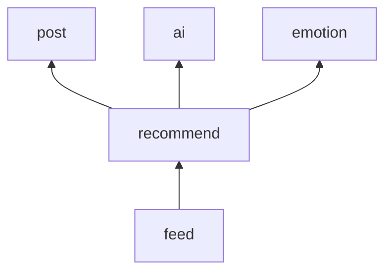

# Data Model: 비슷한 고민 추천 (007-recommend)

Flyway `V7__recommend.sql`로 만든다. 결정 근거는 [research.md](research.md)다.

## 새 테이블 (소유: `recommend`)

### `post_embedding`

글 하나의 임베딩과 처리 일정.

| 열 | 타입 | 설명 |
|---|---|---|
| `post_id` | BIGINT, PK | 글마다 하나다 |
| `author_id` | BIGINT NOT NULL | 보는 사람 자신의 글을 뺄 때 쓴다(R5). 바뀌지 않는다 |
| `status` | VARCHAR(10) NOT NULL | `PENDING` 기다림, `DONE` 끝남, `GIVEN_UP` 24시간 실패해 그만둠 |
| `embedding` | halfvec(2048) | 마지막으로 만든 값. 고쳐서 다시 기다리는 동안에도 이전 값이 남는다 |
| `model` | VARCHAR(100) | `embedding`을 만든 모델. 값이 없으면 NULL |
| `content_version` | TIMESTAMPTZ NOT NULL | 처리할 내용의 `updated_at`. 늦은 결과를 버리는 기준(R4) |
| `embedded_version` | TIMESTAMPTZ | `embedding`을 만든 내용의 `updated_at` |
| `attempts` | INT NOT NULL DEFAULT 0 | |
| `next_attempt_at` | TIMESTAMPTZ NOT NULL | |
| `last_error` | VARCHAR(100) | 실패의 분류만. 공급자의 응답을 담지 않는다 |
| `created_at` | TIMESTAMPTZ NOT NULL | 24시간 기한의 기준. 고치면 그때로 다시 잡는다 |
| `completed_at` | TIMESTAMPTZ | |

- CHECK: `status IN ('PENDING', 'DONE', 'GIVEN_UP')`, `status <> 'DONE' OR (embedding IS NOT NULL AND model IS NOT NULL)`, `(embedding IS NULL) = (model IS NULL)`, `attempts >= 0`.
- `CREATE INDEX post_embedding_hnsw_idx ON post_embedding USING hnsw (embedding halfvec_cosine_ops)`.
- `CREATE INDEX post_embedding_pending_idx ON post_embedding (next_attempt_at) WHERE status = 'PENDING'`.
- FK를 걸지 않는다. `posts`는 다른 모듈의 테이블이다.

**상태 규칙**

```text
(없음) ──글 저장──▶ PENDING ──성공──▶ DONE ──글 고침──▶ PENDING
                     └──24시간 실패──▶ GIVEN_UP ──글 고침──▶ PENDING
글 삭제 ──▶ 행 삭제
```

- 추천에 쓰는 것은 `embedding`이 있고 `model`이 지금 모델인 행이다. `PENDING`이어도 이전 값이 있으면 쓴다(US3-AC4).
- 다른 글의 후보가 되는 것은 `status = 'DONE'`인 행만이다.

## 파사드

**새로 생기는 것**

```kotlin
// recommend
interface RecommendApi {
    /** [postId]와 비슷한 글. 보는 사람의 글, 숨긴 글, 지운 글은 없다. */
    fun similar(postId: Long, viewerId: Long, limit: Int): Recommendation
}

data class Recommendation(
    val postIds: List<Long>,          // 가까운 순서(또는 최근 순서)
    val basis: RecommendationBasis,   // SIMILAR, SAME_EMOTION, NONE
    val pending: Boolean,             // 이 글의 값을 아직 만들고 있다. 화면이 다시 받을지 정한다
)

// ai
interface Embedder {
    /** [content]의 임베딩. 실패하면 EmbeddingFailed(kind). [key]는 로그용이다. */
    fun embed(key: String, content: String): Embedding
}
data class Embedding(val model: String, val values: FloatArray)
```

**더하는 것**

- `EmotionApi.recentPostIds(emotion: EmotionType, limit: Int): List<Long>`: 그 감정으로 분석된 글의 ID. 최근 것부터(R6).
- `PostApi.visibleSummaries(postIds: Collection<Long>, viewerId: Long): List<PostSummary>`와 `PostPage`로 감싸는 길: 보이는 글만, 준 순서대로. `feed`가 카드로 조립한다(R1).
- `PostModerationApi.scan`은 `safety` 전용이라 쓰지 않는다. `PostApi.idsAfter(afterId, limit)`를 더한다(지우지 않은 글의 ID와 작성자, 고친 시각. R7).

## 이벤트

새 이벤트는 없다. `recommend`는 `post`의 `PostWritten`(커밋 뒤 비동기)과 `PostRemoved`를 받는다.

## 의존 그래프의 변화



## 설정

| 키 | 기본값 | 뜻 |
|---|---|---|
| `ogu.ai.embedding-model` | `nvidia/nemotron-3-embed-1b` | 임베딩 모델(`AI_EMBEDDING_MODEL`) |
| `ogu.recommend.max-distance` | 0.40 | 이보다 가까운 글만 비슷한 고민이다(R5, R9) |
| `ogu.recommend.candidates` | 30 | 거르기 전에 읽는 후보 수 |
| `ogu.recommend.retry.*` | 30s, 5m, 24h, 10s, 20 | 처음 간격, 최대 간격, 기한, 훑는 주기, 한 번에 맡는 수 |
| `ogu.recommend.backfill.enabled` / `batch-size` | true / 1000 | 이미 있는 글 처리(R7) |
